# کهکشان فاوا — پلتفرم نمایشگاه شرکت‌های فناور

پلتفرم عمومی برای معرفی پارک‌های علم و فناوری کشور، شرکت‌های مستقر در هر پارک،
و محصولات آن‌ها. سامانه یک بخش نمایش عمومی برای بازدیدکنندگان، یک داشبورد
مالک‌شرکت برای ثبت و ویرایش پروفایل، و یک کنسول مدیریتی برای بازبینی و انتشار
محتوا دارد.

مخاطبان این مستند دو گروه‌اند: توسعه‌دهنده‌ای که تازه به تیم می‌پیوندد و باید
پروژه را در چند ساعت روی ماشین خود بالا بیاورد، و توسعه‌دهنده‌ای که پس از چند
ماه می‌خواهد بخش جدیدی اضافه کند بدون اینکه قراردادهای موجود را بشکند.

---

## Table of Contents

- [Stack](#stack)
- [Getting Started](#getting-started)
- [Environment Variables](#environment-variables)
- [Architecture](#architecture)
- [Data Model](#data-model)
- [Security Model & RLS](#security-model--rls)
- [API Reference](#api-reference)
- [Testing Strategy](#testing-strategy)
- [Deployment](#deployment)
- [Contributing](#contributing)
- [Non-Functional Requirements](#non-functional-requirements)
- [Operational Requirements](#operational-requirements)
- [Troubleshooting](#troubleshooting)


---

## Stack

Frontend runs on **TanStack Start** (React 19, Vite 7, file‑based routing).
Styling is **Tailwind CSS v4** via `@tailwindcss/vite`, with all tokens declared
in `src/styles.css`. Data lives in **PostgreSQL** managed by Supabase; auth,
storage, and the auto‑generated Data API (PostgREST) come from the same
platform. Deployment target is **Cloudflare Workers** with `nodejs_compat`;
edge functions are avoided for internal logic in favour of `createServerFn`.

We deliberately avoid several patterns:

- No `src/pages/`. Routes live under `src/routes/` — the Vite plugin regenerates
  `routeTree.gen.ts`.
- No Supabase Edge Functions for app‑internal reads and writes. They are
  reserved for external webhooks under `/api/public/*`.
- No admin service‑role client in the browser bundle. `client.server.ts` is
  loaded lazily inside handler bodies to keep it out of client chunks.

---

## Getting Started

```bash
# 1. install
bun install

# 2. copy env and fill in Supabase credentials (see next section)
cp .env.example .env

# 3. seed sample parks, companies, and products
bun run seed

# 4. start the dev server (http://localhost:8080)
bun dev
```

The seed script is idempotent and prefixes every row with `[SEED]`, so you can
re‑run it or clear it with `bun run reset:dev`.

### Available scripts

| Command                    | What it does                                                     |
| -------------------------- | ---------------------------------------------------------------- |
| `bun dev`                  | Vite dev server on port 8080                                     |
| `bun run build`            | Production build for Cloudflare Workers                          |
| `bun run build:dev`        | Build with development mode flags (used by CI smoke tests)       |
| `bun run lint`             | ESLint over the whole tree                                       |
| `bun run seed`             | Insert local demo data (parks, companies, products)              |
| `bun run reset:dev`        | Delete rows tagged `[SEED]`                                       |
| `bun run test:visual`      | Playwright screenshot diff for exhibition surfaces               |
| `bun run test:api`         | PostgREST contract tests for company/product endpoints           |
| `bun run test:product-routing` | Smoke test for company/product URL scheme                    |

---

## Environment Variables

| Variable                        | Scope   | Purpose                                                             |
| ------------------------------- | ------- | ------------------------------------------------------------------- |
| `VITE_SUPABASE_URL`             | client  | Data API base URL used by the browser Supabase client               |
| `VITE_SUPABASE_PUBLISHABLE_KEY` | client  | Anon key; safe in the bundle, bounded by RLS                        |
| `VITE_SUPABASE_PROJECT_ID`      | client  | Used for storage bucket URL construction                            |
| `SUPABASE_URL`                  | server  | Same host, read from server functions and seed scripts              |
| `SUPABASE_PUBLISHABLE_KEY`      | server  | Server‑side publishable client for public reads                     |
| `SUPABASE_SERVICE_ROLE_KEY`     | server  | Privileged operations only (seed, migrations, verified webhooks)    |
| `LOVABLE_API_KEY`               | server  | AI gateway; leave unset if you don't need generation features       |
| `VITE_LOVABLE_CONNECTOR_GOOGLE_MAPS_BROWSER_KEY` | client | Managed Maps JS key; valid only on `*.lovable.app` / `*.lovableproject.com` |
| `VITE_GOOGLE_MAPS_DEV_KEY`      | client  | Optional developer key so Google Maps also renders on `localhost`   |

Rules:

- Never rename `SUPABASE_SERVICE_ROLE_KEY` to a `VITE_*` variable.
- Server-only variables are read inside handler bodies, never at module scope
  of shared files (they resolve to `undefined` on Cloudflare Workers otherwise).

### Maps in local development

The managed Google key is referrer-restricted to Lovable domains, so on
`localhost` it would return `RefererNotAllowedMapError`. The company map handles
this in two layers:

1. **Optional dev key.** Create a key in Google Cloud → *APIs & Services →
   Credentials*, enable **Maps JavaScript API**, and add these HTTP referrers:
   `http://localhost:8080/*` and `http://127.0.0.1:8080/*`. Put it in your local
   `.env` as `VITE_GOOGLE_MAPS_DEV_KEY=...` (never commit a real key). The map
   then behaves exactly as in production.
2. **Keyless fallback.** Without a dev key — or if Google rejects the referrer
   (`gm_authFailure`) — the component silently renders a Leaflet /
   OpenStreetMap map with the same marker, popup and `data-testid`, so local
   development never shows a map error.


---

## Architecture

The platform is split into three logical planes: a **public read plane** that
serves anonymous visitors, an **owner write plane** for company profiles, and
a **privileged control plane** for admin workflows. Each plane uses a
different Supabase principal and a different network path.

### System context

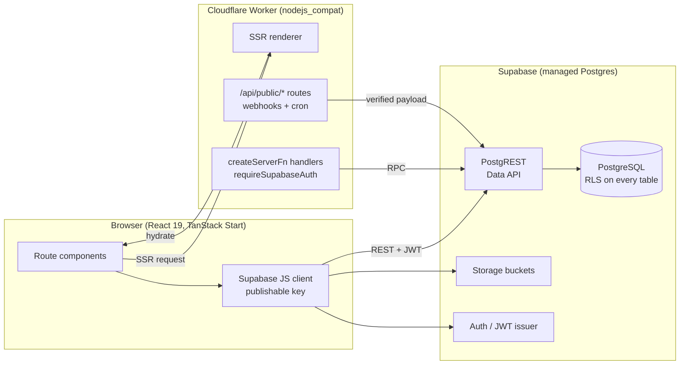

### Request flow

Three canonical flows share the same edge; RLS is what keeps them isolated.

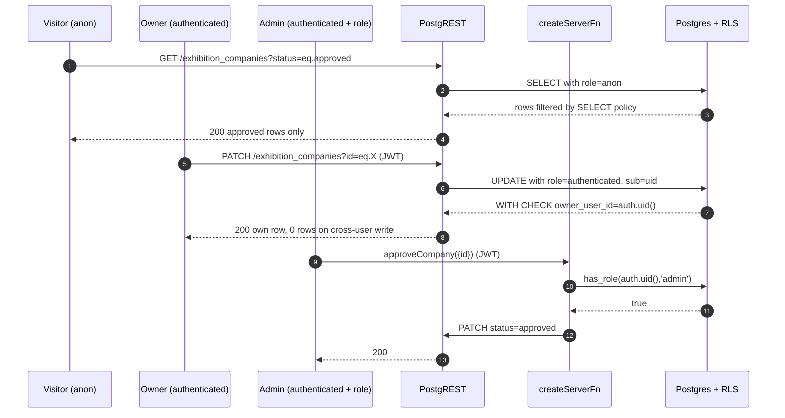

### Deployment topology

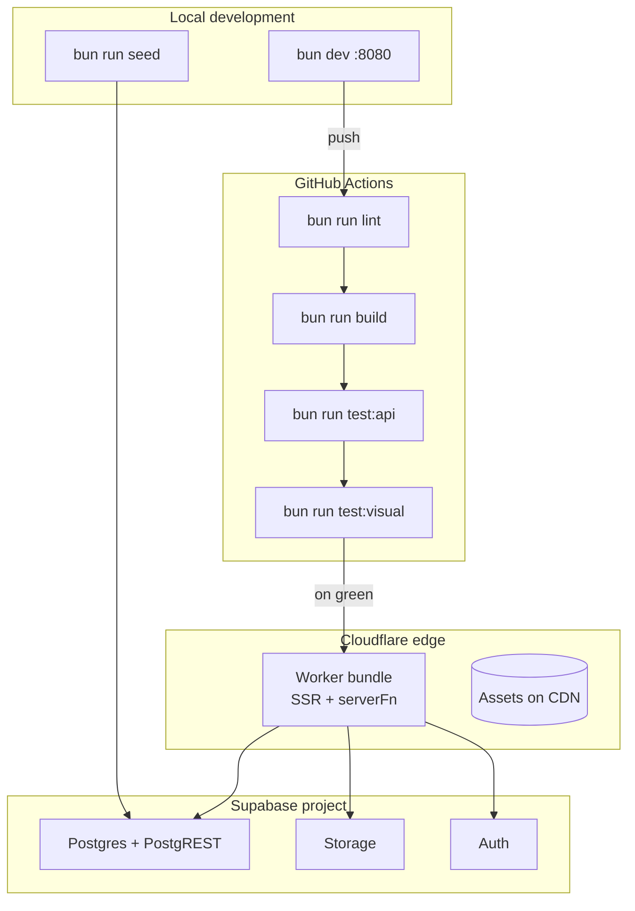

### Route layout

```
src/routes/
├── __root.tsx              — shell, head, providers, <Outlet />
├── index.tsx               — landing page
├── about.tsx               — public about page
├── auth.tsx                — sign-in / sign-up flows
├── exhibition.tsx          — public grid of approved companies
├── company.$id.index.tsx   — company profile (SSR + share metadata)
├── company.$id.product.$pid.tsx — product detail (canonical share URL)
├── kahkeshan.tsx           — 3D park map (client-only vendor bundle)
├── parks.tsx               — public list of parks
├── my-company.tsx          — owner dashboard (requires auth)
├── register-company.tsx    — owner onboarding
├── admin.exhibition.tsx    — admin review console (approve / reject)
├── admin.parks.tsx         — park CRUD + reorder
├── admin.kahkeshan.tsx     — park layout editor
├── admin.attachments.tsx   — attachment moderation
└── admin.about.tsx         — CMS for the about page
```

Filename dots become URL slashes; `$id` is a dynamic segment. Never edit
`src/routeTree.gen.ts` — the Vite plugin regenerates it.

### Module boundaries

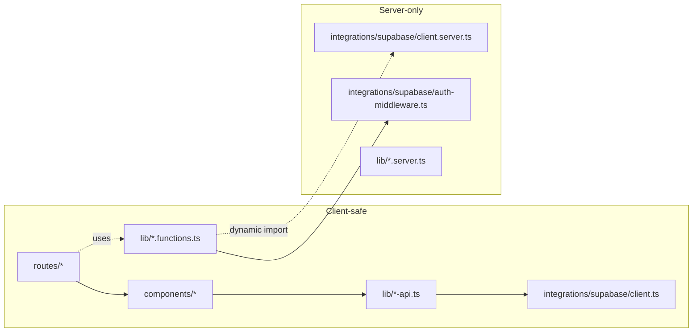

`client.server.ts` (service-role) is only loaded via `await import()` inside
handler bodies. Static imports into the client graph fail the build.


---

## Data Model

### Entity relationship diagram

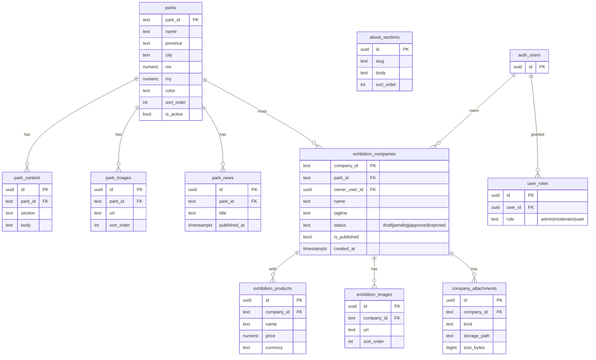

### Company workflow state machine

`status` and `is_published` are independent on purpose: an admin can hide an
approved company without losing its review trail.

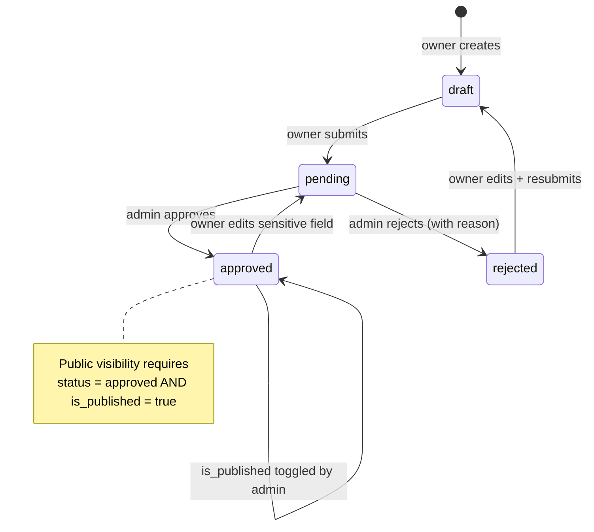

### Table catalogue

| Table                  | Purpose                                                       | Key relationships                                |
| ---------------------- | ------------------------------------------------------------- | ------------------------------------------------ |
| `parks`                | Top-of-hierarchy science parks; drives the `kahkeshan` map    | 1..N with content/images/news/companies          |
| `park_content`         | CMS blocks (about, contacts) per park                         | N..1 `parks`                                     |
| `park_images`          | Gallery slots per park                                        | N..1 `parks`                                     |
| `park_news`            | Announcements shown on the park detail                        | N..1 `parks`                                     |
| `exhibition_companies` | Company profile with `status` + `is_published` workflow       | N..1 `parks`, N..1 `auth.users` (owner)          |
| `exhibition_products`  | Products under a company; canonical share URL                 | N..1 `exhibition_companies`                      |
| `exhibition_images`    | Media slots per company                                       | N..1 `exhibition_companies`                      |
| `company_attachments`  | Signed-URL files (brochures, certificates)                    | N..1 `exhibition_companies`                      |
| `about_sections`       | CMS blocks for `/about`                                       | standalone                                       |
| `user_roles`           | Role assignments; separated to prevent privilege escalation   | N..1 `auth.users`                                |

### Data lifecycle algorithm

The canonical rule enforced by RLS and the review console:

```text
public visible(company) :=
  company.status = 'approved'
  AND company.is_published = true
  AND EXISTS park WHERE park.park_id = company.park_id
                    AND park.is_active = true
```

Any read that violates this predicate is stripped by the anon SELECT policy —
the client cannot re-introduce hidden rows by guessing IDs.


---

## Security Model & RLS

Every table in `public` has RLS enabled. Grants are issued per role in the same
migration that creates the table. Three principals are relevant:

| Role            | Comes from                          | Typical use                          |
| --------------- | ----------------------------------- | ------------------------------------ |
| `anon`          | Requests with the publishable key   | Public reads of approved content     |
| `authenticated` | Signed‑in user (JWT)                | Owner reads/writes to own rows       |
| `service_role`  | Server‑only, never in browser       | Seed, migrations, verified webhooks  |

The `admin` capability is a role stored in `user_roles`, checked via the
`SECURITY DEFINER` helper `public.has_role(auth.uid(), 'admin')`. The helper
runs with the definer's privileges to bypass RLS on `user_roles` itself —
without that, a policy on `exhibition_companies` that references `user_roles`
would recurse.

### Access matrix

Read this row-by-row: "principal P on table T may perform operations O,
provided predicate applies."

| Table                  | anon        | authenticated (owner)                | admin (via `has_role`) |
| ---------------------- | ----------- | ------------------------------------ | ---------------------- |
| `parks`                | SELECT (is_active) | SELECT                        | SELECT/INSERT/UPDATE/DELETE |
| `park_content`         | SELECT      | SELECT                               | full                   |
| `park_images`          | SELECT      | SELECT                               | full                   |
| `park_news`            | SELECT      | SELECT                               | full                   |
| `exhibition_companies` | SELECT (approved+published) | SELECT+UPDATE where `owner_user_id=auth.uid()`, INSERT with `owner_user_id=auth.uid()` | full including `status` transitions |
| `exhibition_products`  | SELECT (parent approved) | full where parent company owned by user | full |
| `exhibition_images`    | SELECT (parent approved) | full on own company            | full                   |
| `company_attachments`  | none        | full on own company                   | full                   |
| `about_sections`       | SELECT      | SELECT                               | full                   |
| `user_roles`           | none        | SELECT own via `has_role`             | INSERT/DELETE          |

Owner writes cannot set `status='approved'`; the WITH CHECK clause on the
UPDATE policy forbids that transition — only admins can move a row into or
out of `approved`.

### RLS decision flow

Every request that touches a public-schema table walks this path:

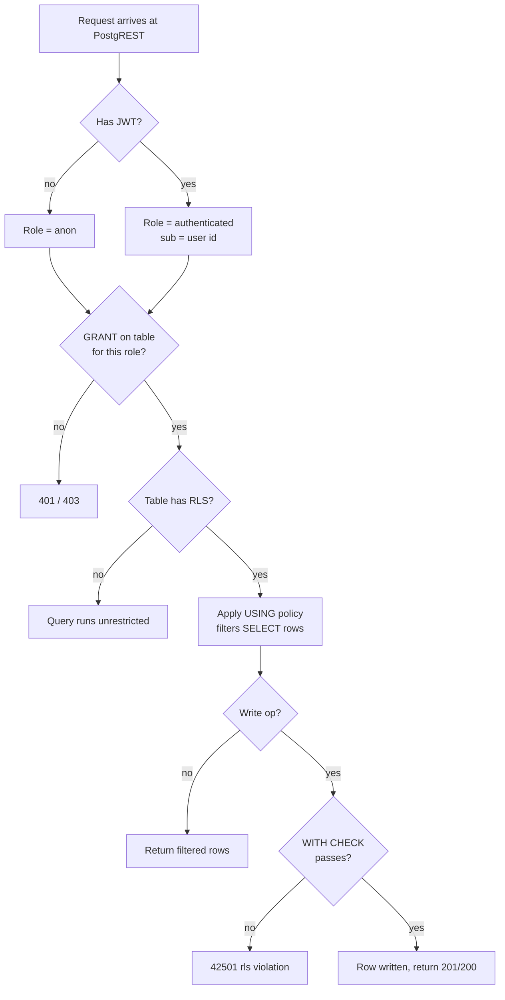

If a request fails, this diagram is the debugging checklist: GRANT missing
(hint text mentions the role), USING filter hides the row, or WITH CHECK
rejects the payload.

### Recursion-safe `has_role`

```sql
create or replace function public.has_role(_user_id uuid, _role app_role)
returns boolean
language sql
stable
security definer
set search_path = public
as $$
  select exists (
    select 1 from public.user_roles
    where user_id = _user_id and role = _role
  );
$$;

revoke execute on function public.has_role(uuid, app_role) from public;
grant execute on function public.has_role(uuid, app_role) to authenticated;
```

Without `SECURITY DEFINER` a policy on `exhibition_companies` that calls
`has_role` would itself query `user_roles`, which would trigger its own RLS
policy, which would call `has_role` again → infinite recursion. The definer
runs as the function owner, bypasses `user_roles` RLS exactly once, and
returns a boolean. `search_path` is pinned to avoid shadowing attacks.


### Verifying policies with psql

Real policies are easier to audit against real SQL than against prose. The
following snippets impersonate each principal on a local psql session
connected as `postgres`:

```sql
-- Public: only approved & active companies should be visible.
SET LOCAL role TO anon;
SELECT company_id, status FROM public.exhibition_companies;
-- expect: no rows where status <> 'approved'
RESET role;
```

```sql
-- Owner: can update own row, cannot flip status to 'approved'.
SET LOCAL role TO authenticated;
SET LOCAL "request.jwt.claim.sub" TO '00000000-0000-0000-0000-000000000001';
UPDATE public.exhibition_companies SET tagline = 'new'
  WHERE owner_user_id = '00000000-0000-0000-0000-000000000001';
-- expect: 1 row updated

UPDATE public.exhibition_companies SET status = 'approved'
  WHERE owner_user_id = '00000000-0000-0000-0000-000000000001';
-- expect: 0 rows (RLS strips the write)
RESET role;
```

```sql
-- Cross-user attack: authenticated user tries to touch someone else's row.
SET LOCAL role TO authenticated;
SET LOCAL "request.jwt.claim.sub" TO '00000000-0000-0000-0000-000000000002';
DELETE FROM public.exhibition_companies WHERE company_id = 'seed-alpha';
-- expect: 0 rows
RESET role;
```

The Python contract test in `scripts/test-api-contracts.py` performs the same
checks over HTTP against PostgREST, so they run in CI without a database
session.

### Security checklist for PRs touching schema

1. Every new public table has explicit `GRANT`s in the same migration.
2. RLS is enabled and the policy set covers `SELECT`, `INSERT`, `UPDATE`,
   `DELETE` — with `WITH CHECK` clauses where writes are permitted.
3. Any new `SECURITY DEFINER` function pins `search_path` and revokes
   `EXECUTE` from `public` if it should not be callable by end users.
4. Leaked Password Protection (HIBP) stays enabled in Auth settings.
5. Sensitive columns are omitted from anonymous SELECT policies rather than
   filtered client‑side.

### Granting the admin role

Admin-only routes (`/admin/*`) require a row in `public.user_roles` with
`role = 'admin'` for the signed-in user. If the admin panel shows an empty
list or a "no admin role" screen, the current account has not been granted
the role. Sign up via `/auth`, copy the `User ID` shown on the
"no access" screen, then run:

```sql
INSERT INTO public.user_roles (user_id, role)
VALUES ('<user-uuid>', 'admin')
ON CONFLICT (user_id, role) DO NOTHING;
```

The first user who signs up is auto-promoted to admin by the
`handle_first_user_admin` trigger; every subsequent admin must be granted
explicitly.

---

## API Reference

The Data API is PostgREST. The functions in `src/lib/exhibition-api.ts` and
`src/lib/parks-api.ts` are thin wrappers that document the contract.

### Companies

| Method | Path (PostgREST)                        | Auth      | Purpose                                | Common errors               |
| ------ | --------------------------------------- | --------- | -------------------------------------- | --------------------------- |
| GET    | `/exhibition_companies`                 | anon      | List approved & published companies    | none                        |
| GET    | `/exhibition_companies?company_id=eq.X` | anon      | Single company                         | 406 if not found            |
| POST   | `/exhibition_companies`                 | user      | Create own draft (`owner_user_id` set) | 401, 42501 RLS violation     |
| PATCH  | `/exhibition_companies?company_id=eq.X` | user/admin| Update fields (owner cannot approve)   | 42501, 400 on bad enum      |
| DELETE | `/exhibition_companies?company_id=eq.X` | admin     | Hard delete                            | 42501                        |

### Products

| Method | Path                              | Auth  | Purpose                     | Common errors        |
| ------ | --------------------------------- | ----- | --------------------------- | -------------------- |
| GET    | `/exhibition_products`            | anon  | List for approved companies | none                 |
| POST   | `/exhibition_products`            | user  | Add product to own company  | 401, 23502 NOT NULL  |
| PATCH  | `/exhibition_products?id=eq.X`    | user  | Update own product          | 42501                |
| DELETE | `/exhibition_products?id=eq.X`    | user  | Remove own product          | 42501                |

### Server functions

For write flows that need cross‑table integrity we use `createServerFn` with
`requireSupabaseAuth`. Add new ones in `src/lib/*.functions.ts` and register
them next to their sibling client wrapper.

---

## Testing Strategy

We keep three layers, each cheap enough to run in CI:

1. **Contract tests** (`bun run test:api`) hit PostgREST with the publishable
   key and assert RLS behaviour and status codes. They double as living
   documentation for the API table above.
2. **Visual regression** (`bun run test:visual`) captures three viewports
   (desktop 1280, tablet 768, mobile 375) for the company profile and product
   detail pages. Diffs are uploaded as CI artifacts.
3. **Routing smoke** (`bun run test:product-routing`) verifies the canonical
   URL scheme for shareable product links.

A change that alters the DOM structure of the company or product page must
either preserve pixel output or update baselines in the same PR. A change to
RLS must update the contract test.

### Test pyramid

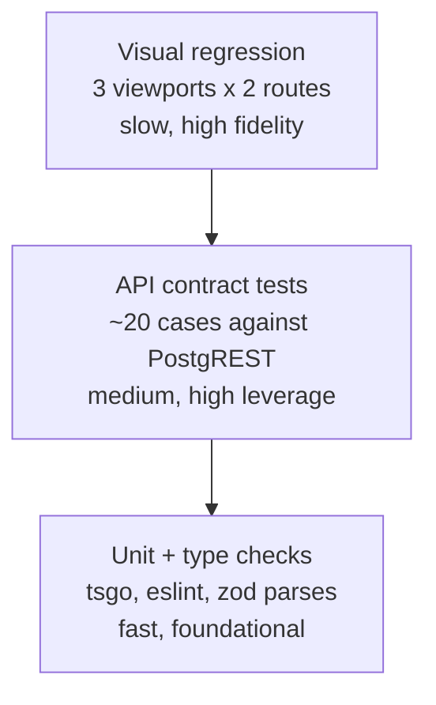

### CI pipeline

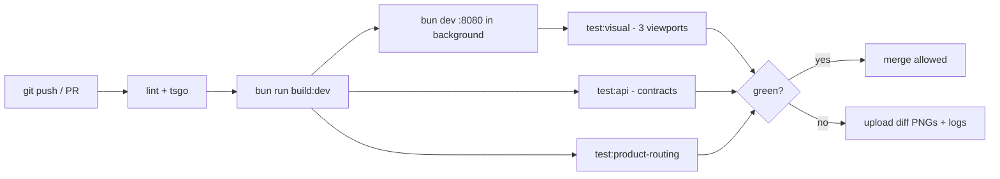

---

## Deployment

Production runs on Cloudflare Workers with `nodejs_compat`. `bun run build`
produces the Worker bundle; the platform picks it up automatically.

Migrations live under `supabase/migrations/*.sql` and are applied in filename
order. Never edit an applied migration — write a new one that alters the
previous state. Rollbacks are forward‑only: a bad migration is undone by a
follow‑up migration, not by deleting the file.

### Release flow

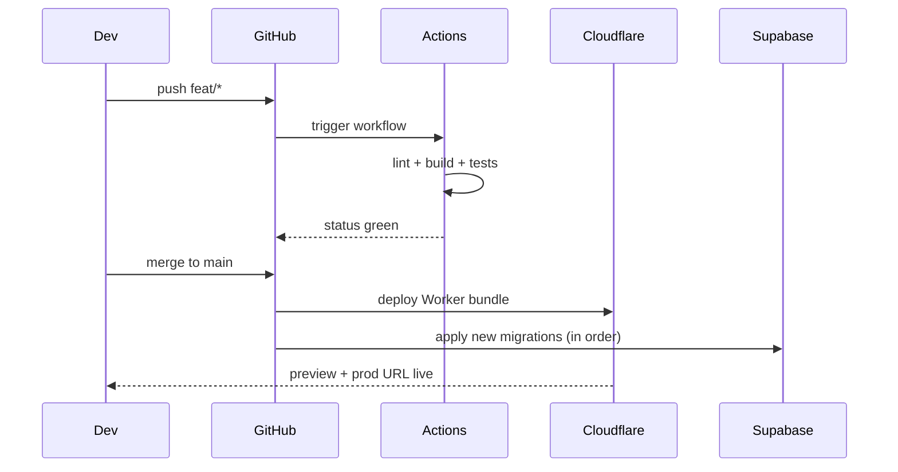

---

## Contributing

Branches are named `feat/<slug>`, `fix/<slug>`, or `chore/<slug>`. Commits
follow Conventional Commits (`feat:`, `fix:`, `refactor:`, `docs:`, `test:`).
One logical change per PR.

### PR lifecycle

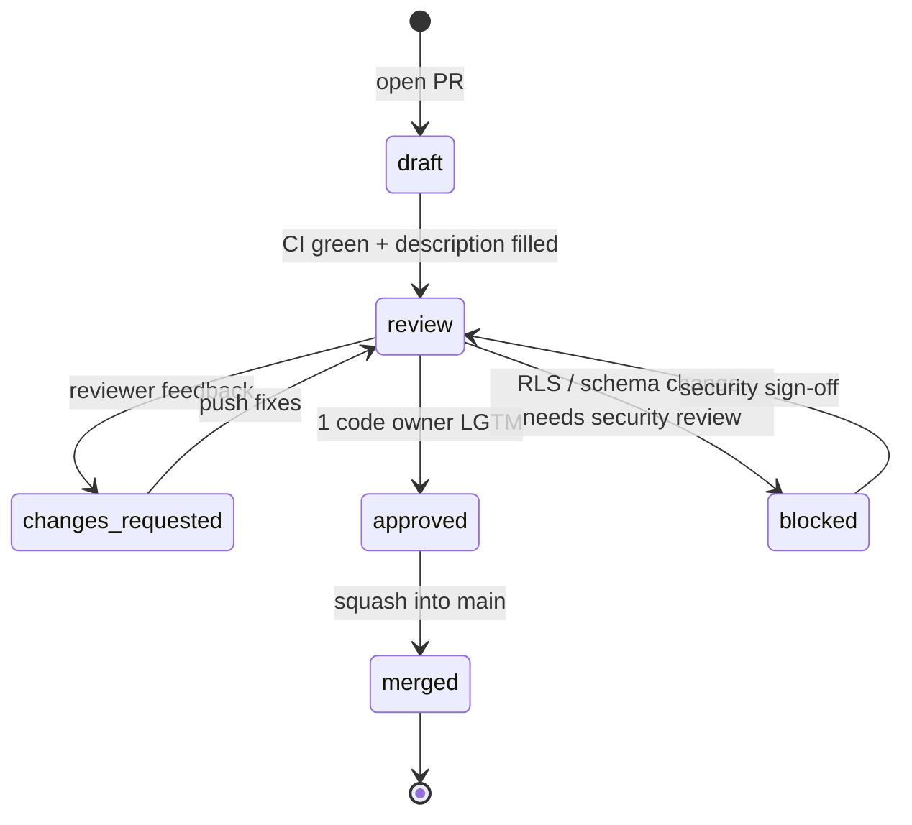


### Code review checklist

- [ ] Schema changes include GRANTs, RLS, and a contract test update.
- [ ] New routes ship `errorComponent` and `notFoundComponent`.
- [ ] Server functions read secrets inside `.handler()`, not at module scope.
- [ ] `client.server.ts` is imported dynamically, not at the top of a file the
      browser can reach.
- [ ] User‑facing text is in Persian; internal identifiers stay ASCII.
- [ ] Visual baselines updated or explicitly justified.

### Ownership map

| Area                            | Primary reviewer            |
| ------------------------------- | --------------------------- |
| Public exhibition surfaces      | Frontend lead               |
| Admin console & workflow        | Backend lead                |
| RLS policies & migrations       | Backend lead + security     |
| 3D map (`kahkeshan`)            | Frontend lead               |
| CI, scripts, tooling            | Platform                    |

---

## Non-Functional Requirements

الزامات کیفی که هر Pull Request باید رعایت کند. نقض این قوانین در code review مسدود می‌شود.

### Compliance checklist

قبل از merge، این چک‌لیست باید سبز باشد. هر مورد قرمز → PR مسدود.

| Requirement                        | Threshold                                  | Enforced by                              |
| ---------------------------------- | ------------------------------------------ | ---------------------------------------- |
| Client bundle (initial, gzip)      | ≤ 200 KB                                   | `bun run build` + `du -sh dist/client/assets/*.js` |
| LCP (mobile, throttled 4G)         | ≤ 2.5 s                                    | Lighthouse CI in `playwright.yml`         |
| Edge TTFB (public read)            | ≤ 100 ms p75                               | Cloudflare Analytics                      |
| Server function p95 latency        | ≤ 300 ms                                   | Logflare query                            |
| CSP / X-Frame-Options / HSTS       | headers present on every HTML response     | manual curl + `test-visual-regression.py` |
| Color contrast                     | ≥ 4.5:1 text / ≥ 3:1 icon                  | axe-core (visual test)                    |
| i18n scope                         | Persian only in UI files                   | `bun run lint:i18n`                       |
| RLS-predicate indexes              | composite index on `(status, is_active, …)` for every scoped table | migration + `EXPLAIN` in review |

### Performance & Scaling

هر کوئری از میان لایه RLS عبور می‌کند؛ سربار predicate روی جدول‌های بدون ایندکس مناسب به سرعت O(N) می‌شود. Budgetها را هرگز نقض نکنید.

| متریک                          | Budget                    | ابزار سنجش                     |
| ------------------------------ | ------------------------- | ------------------------------ |
| Client bundle (gzip, initial)  | ≤ 200 KB                  | `vite build` + `du -sh`        |
| Edge TTFB (public read)        | ≤ 100 ms                  | Cloudflare Analytics           |
| LCP (mobile, 4G)               | ≤ 2.5 s                   | Lighthouse CI                  |
| Server function p95            | ≤ 300 ms                  | Logflare / Sentry Performance  |
| Query plan rows scanned        | ≤ 1000 در filtered read   | `EXPLAIN ANALYZE`              |

**قانون ایندکس‌گذاری:** هر جدول با RLS باید ایندکس کامپوزیت روی ستون‌های predicate داشته باشد. کوئری روی `status` و `is_active` بدون ایندکس پشتیبان — ممنوع.

```sql
CREATE INDEX IF NOT EXISTS idx_companies_status_pub
  ON public.exhibition_companies (status, is_active, sort_order);

CREATE INDEX IF NOT EXISTS idx_products_company
  ON public.exhibition_products (company_id, sort_order);

CREATE INDEX IF NOT EXISTS idx_attachments_owner
  ON public.company_attachments (owner_type, owner_id, kind, sort_order);
```

**سنجش بودجه bundle:**

```bash
bun run build
du -sh dist/client/assets/*.js | sort -h
# entry chunk MUST be ≤ 200KB gzip. gzip -c <file> | wc -c
```

**قانون code-splitting:** روت‌های ادمین باید lazy import شوند. import مستقیم `admin.*` از روت‌های عمومی — ممنوع. عبور از 200KB روی entry chunk → PR باید `React.lazy` یا route-level dynamic import اضافه کند.

### Security Boundaries

جدول هدرهای اجباری روی همه پاسخ‌های HTML (تنظیم در `src/server.ts` یا Cloudflare Worker middleware، نه در روت‌های منفرد):

| Header                        | مقدار توصیه‌شده                                                                                       |
| ----------------------------- | ----------------------------------------------------------------------------------------------------- |
| `Content-Security-Policy`     | `default-src 'self'; script-src 'self' 'wasm-unsafe-eval'; style-src 'self' 'unsafe-inline'; img-src 'self' data: blob: https://*.supabase.co; connect-src 'self' https://*.supabase.co; frame-ancestors 'none'; base-uri 'self'; form-action 'self'` |
| `X-Frame-Options`             | `DENY`                                                                                                |
| `X-Content-Type-Options`      | `nosniff`                                                                                             |
| `Referrer-Policy`             | `strict-origin-when-cross-origin`                                                                     |
| `Permissions-Policy`          | `camera=(), microphone=(), geolocation=(), interest-cohort=()`                                        |
| `Strict-Transport-Security`   | `max-age=63072000; includeSubDomains; preload`                                                        |

نمونه اعمال در Worker:

```ts
// src/server.ts — پس از دریافت response از handler
const SECURITY_HEADERS: Record<string, string> = {
  "Content-Security-Policy":
    "default-src 'self'; script-src 'self' 'wasm-unsafe-eval'; " +
    "style-src 'self' 'unsafe-inline'; img-src 'self' data: blob: https://*.supabase.co; " +
    "connect-src 'self' https://*.supabase.co; frame-ancestors 'none'; base-uri 'self'",
  "X-Frame-Options": "DENY",
  "X-Content-Type-Options": "nosniff",
  "Referrer-Policy": "strict-origin-when-cross-origin",
  "Permissions-Policy": "camera=(), microphone=(), geolocation=()",
  "Strict-Transport-Security": "max-age=63072000; includeSubDomains; preload",
};
for (const [k, v] of Object.entries(SECURITY_HEADERS)) response.headers.set(k, v);
```

**قوانین سخت‌گیرانه:**

- کلاینت هرگز با service role به دیتابیس متصل نمی‌شود. `supabaseAdmin` فقط داخل handler یک serverFn، پس از احراز نقش، dynamic import می‌شود.
- هر دسترسی جدولی از کلاینت باید از anon/authenticated + RLS عبور کند، یا از serverFn محافظت‌شده با `requireSupabaseAuth`.
- `dangerouslySetInnerHTML` روی محتوای CMS بدون sanitize (DOMPurify) — ممنوع.
- CSP نباید `'unsafe-eval'` یا wildcard `script-src *` داشته باشد. `'wasm-unsafe-eval'` تنها استثنا (برای libarchive/three).
- `frame-ancestors 'none'` غیرقابل مذاکره — پلتفرم هرگز نباید داخل iframe سایت دیگر رندر شود.

**پیاده‌سازی فعلی — report-only rollout و enforce production:**

- در dev و preview هدر `Content-Security-Policy-Report-Only` (نه enforce) روی پاسخ‌های HTML ست می‌شود؛ سیاست کامل در `src/lib/csp.ts` است و مقصد گزارش `POST /api/public/csp-report`.
- endpoint گزارش (`src/routes/api/public/csp-report.ts`) payload را با Zod اعتبارسنجی می‌کند، فقط directive/URL را لاگ می‌کند (بدون PII)، و rate-limit درون‌حافظه‌ای (۱۰۰ گزارش/دقیقه) دارد.
- **پیش‌فرض production: enforce.** `shouldEnforceCsp()` وقتی `NODE_ENV=production` است هدر `Content-Security-Policy` را اعمال می‌کند مگر اینکه `CSP_ENFORCE=0` صریحاً ست شود.

| Environment                       | Header                                | Behavior             |
| --------------------------------- | ------------------------------------- | -------------------- |
| dev / preview                     | `Content-Security-Policy-Report-Only` | فقط گزارش، بدون block |
| production (پیش‌فرض)              | `Content-Security-Policy`             | Block + گزارش        |
| production با `CSP_ENFORCE=0`     | `Content-Security-Policy-Report-Only` | rollback موقت        |

**Enforcement rollout checklist — قبل از deploy اول به production:**

1. حداقل ۷ روز production traffic زیر report-only.
2. صفر critical violation (منظور: هر violation از دامنه خودی یا `*.supabase.co`).
3. violationهای غیر critical (extension، DevTools) در `.lovable/csp-known-noise.md` مستند شوند.

**Rollback:** ست کردن `CSP_ENFORCE=0` روی Worker → deploy → بازگشت به report-only (تخمین ۲ دقیقه).


### Accessibility (a11y)

| مورد                                      | الزام                                              |
| ----------------------------------------- | -------------------------------------------------- |
| دکمه‌های approve/reject در پنل ادمین      | `aria-label` مشخص (مثلاً "تایید شرکت X")           |
| پیام خطای فرم                              | `role="alert"` + focus خودکار به اولین فیلد خطادار |
| Dialog / Modal                             | focus trap + بستن با `Esc`                         |
| کنتراست رنگ                                | ≥ 4.5:1 (متن)، ≥ 3:1 (آیکون)                       |
| لینک‌های shareable (company/product)      | قابل پیمایش کامل با کیبورد                         |
| تصاویر گالری                               | `alt` غیرخالی؛ عکس تزئینی → `alt=""`               |
| فرم‌های ادمین                              | هر `input` باید `label` متصل داشته باشد            |

### Internationalization Rules

قانون سخت و غیرقابل مذاکره:

> **فارسی فقط در لایه UI (JSX / کامپوننت‌ها) مجاز است. Server Functions، migrationها، پیام‌های `throw new Error`، لاگ‌های سرور، نام ستون‌ها، و enumها هرگز فارسی نمی‌گیرند.**

| Layer                          | زبان مجاز                | مثال                                                        |
| ------------------------------ | ------------------------ | ----------------------------------------------------------- |
| JSX label / heading            | فارسی                    | `<Button>ثبت شرکت</Button>`                                 |
| toast / alert (UI)             | فارسی                    | `toast.success("ذخیره شد")`                                 |
| `throw new Error(...)`         | انگلیسی                  | `throw new Error("company not found")`                      |
| console.log / logger           | انگلیسی                  | `console.warn("rls violation", { code })`                   |
| migration comment / column     | انگلیسی                  | `COMMENT ON COLUMN ... IS 'submission status'`              |
| enum value                     | انگلیسی                  | `'draft' \| 'pending' \| 'approved'`                        |

**Enforcement — `bun run lint:i18n`:**

اسکریپت `scripts/lint-i18n.ts` روی `src/`, `scripts/`, `supabase/migrations/` می‌گردد. مسیرهای مجاز فارسی: `src/components/**`, `src/routes/**`, `src/hooks/**`. هر فایل `.server.ts` / `.functions.ts` حتی داخل مسیرهای مجاز، deny است. یافتن نویسه‌های `\u0600–\u06FF` در فایل ممنوع → exit 1.

```bash
$ bun run lint:i18n
i18n lint: 2 violation(s)
Persian text is only permitted in src/components/**, src/routes/**, src/hooks/** (non-.server/.functions).
  src/lib/exhibition-api.ts:42  throw new Error("شرکت یافت نشد")
  supabase/migrations/20260710_add_status.sql:8  COMMENT ON COLUMN ... IS 'وضعیت'
```

این اسکریپت باید در CI (`playwright.yml`) پیش از build اجرا شود. نقض این قانون stack trace را برای ابزارهای مانیتورینگ بین‌المللی غیرقابل جستجو می‌کند.

**لایه دوم — runtime gate:** `i18nGuardMiddleware` در `src/lib/i18n-guard.ts` به‌عنوان `functionMiddleware` سراسری در `src/start.ts` ثبت شده است. اگر یک Server Function خطایی throw کند که `Error.message` آن حاوی نویسه‌های `\u0600–\u06FF` باشد، middleware پیام اصلی را با `event: "i18n_violation"` لاگ می‌کند و یک پیام انگلیسی استاندارد (بدون افشای متن فارسی) به کلاینت بازمی‌گرداند. Lint در build-time source را می‌بندد؛ این gate جلوی نشت pattern از وابستگی‌ها یا کدهای اضافه‌نشده به lint را می‌گیرد.

---

## Operational Requirements

قوانین نگهداری، مشاهده‌پذیری، و زیرساخت. این بخش برای کسی است که سیستم را در production نگه می‌دارد.

### Ops readiness checklist

| Requirement                          | Threshold                                | Enforced by                             |
| ------------------------------------ | ---------------------------------------- | --------------------------------------- |
| Cache-Control per route class        | مطابق جدول زیر                            | route `server.handlers` headers         |
| Media upload validation              | حجم + MIME هم کلاینت هم سرور              | `attachments-api.ts` + RLS trigger      |
| Request ID propagation               | `x-request-id` on every response         | `src/server.ts` middleware              |
| Structured logs                      | JSON envelope با فیلدهای اجباری          | `logger` wrapper در `src/lib/logger.ts` |
| Pagination                           | فقط Range/`Content-Range` — cursor ممنوع | `test-api-contracts.py`                 |
| Sensitive data in logs               | صفر PII / صفر token                      | code review + regex scan                |

### Caching Strategy

سطح کش بر اساس نوع مسیر:

| نوع مسیر                     | Cache-Control                                                        | Purge trigger                     |
| ---------------------------- | -------------------------------------------------------------------- | --------------------------------- |
| Public read (`company.$id`)  | `public, max-age=60, s-maxage=300, stale-while-revalidate=3600`      | owner update / admin approve      |
| Public list (`exhibition`)   | `public, max-age=30, s-maxage=120, stale-while-revalidate=600`       | any company status change         |
| Owner dashboard (`/my-company`) | `private, no-store`                                                | —                                 |
| Admin panel (`/admin/*`)     | `private, no-store`                                                  | —                                 |
| Webhooks (`/api/public/*`)   | `no-store`                                                           | idempotency در handler            |
| Static assets (`/assets/*`)  | `public, max-age=31536000, immutable`                                | نسخه‌بندی با hash در filename      |

نمونه در loader:

```ts
// src/routes/company.$id.index.tsx
export const Route = createFileRoute('/company/$id/')({
  loader: async ({ context, params }) =>
    context.queryClient.ensureQueryData(companyQuery(params.id)),
  server: {
    handlers: {
      GET: {
        headers: {
          'Cache-Control': 'public, max-age=60, s-maxage=300, stale-while-revalidate=3600',
          'Cache-Tag': `company:${'${params.id}'}`,
        },
      },
    },
  },
})
```

**Invalidation:** پس از `updateOwnedCompany` یا `approveCompany` باید:

1. `queryClient.invalidateQueries({ queryKey: ['company', id] })` سمت کلاینت.
2. Purge با tag روی edge: `POST /purge` با body `{ tags: ["company:<id>"] }` از داخل serverFn.

بدون purge — کاربر تا 5 دقیقه محتوای قدیمی می‌بیند.

### Media & Storage Constraints

| نوع فایل                | حداکثر حجم | MIME مجاز                                      | مقصد                              |
| ----------------------- | ---------- | ---------------------------------------------- | --------------------------------- |
| Logo                    | 512 KB     | `image/webp`, `image/png`, `image/svg+xml`     | `park-assets/attachments/.../logo` |
| Gallery image           | 2 MB       | `image/webp`, `image/jpeg`, `image/png`        | `park-assets/attachments/.../gallery_image` |
| Catalog / Form (PDF)    | 10 MB      | `application/pdf`                              | `park-assets/attachments/.../catalog` |
| Word document           | 5 MB       | `application/vnd.openxmlformats-...`           | `park-assets/attachments/.../form_*` |

**قانون نمایش:** گالری و لوگو باید از Supabase Image Transformation در لبه resize شوند. سرو مستقیم اصل فایل به کلاینت — ممنوع.

```
https://<project>.supabase.co/storage/v1/render/image/public/park-assets/<path>
  ?width=800&quality=75&resize=contain
```

اعتبارسنجی سمت کلاینت (پیش از upload) **و** سمت سرور (در serverFn) هر دو الزامی است؛ اعتبارسنجی صرفاً کلاینتی — ممنوع.

### Observability & Logging

**Log envelope اجباری** — هر خط لاگ باید این شکل JSON تک‌خطی باشد؛ متن آزاد (`console.log("hi")`) — ممنوع:

```ts
type LogEnvelope = {
  ts: string;              // ISO-8601, UTC
  level: 'info' | 'warn' | 'error';
  request_id: string;      // ULID یا UUID — از header یا crypto.randomUUID
  route: string;           // matched route id, مثل '/company/$id'
  user_id: string;         // uuid یا 'anon'
  event: 'rls_denied' | 'auth_failed' | 'slow_query' | 'upload_rejected' | 'unhandled';
  message: string;         // یک جمله کوتاه انگلیسی
  meta?: {
    pg_code?: string;      // مثل '42501'
    duration_ms?: number;
    table?: string;
    op?: 'SELECT' | 'INSERT' | 'UPDATE' | 'DELETE';
  };
};
```

**جدول رویدادها:**

| Event                    | Level   | فیلدهای اجباری در `meta`             | مسیر ارسال       |
| ------------------------ | ------- | ------------------------------------ | ---------------- |
| RLS violation (`42501`)  | `warn`  | `pg_code`, `table`, `op`             | Logflare + Sentry breadcrumb |
| Unhandled در serverFn    | `error` | —                                    | Sentry `captureException` + Logflare |
| Auth failure (401)       | `info`  | —                                    | Logflare         |
| Slow query (> 500ms)     | `warn`  | `duration_ms`, `table`               | Logflare         |
| Upload rejected          | `warn`  | `mime`, `size_bytes`                 | Logflare         |

**سناریوی 42501 (RLS violation) — کد نمونه:**

```ts
// wrapper اطراف هر write در serverFn
try {
  return await supabase.from(table).update(patch).eq('id', id).select().single();
} catch (e) {
  const pg = (e as { code?: string }).code;
  const base = { request_id, route, user_id: context.userId };
  if (pg === '42501') {
    logger.warn({ ...base, event: 'rls_denied', message: 'RLS policy rejected write',
                  meta: { pg_code: '42501', table, op: 'UPDATE' } });
    throw new Response('Forbidden', { status: 403, headers: { 'x-request-id': request_id } });
  }
  logger.error({ ...base, event: 'unhandled', message: (e as Error).message });
  throw e;
}
```

**Request ID propagation** — یک ID سراسر trace، از edge تا Postgres:

```ts
// src/server.ts
const requestId =
  request.headers.get('x-request-id') ??
  request.headers.get('cf-ray') ??
  crypto.randomUUID();

const response = await handler.fetch(request, env, ctx);
response.headers.set('x-request-id', requestId);
```

- Worker `cf-ray` یا header ورودی `x-request-id` — در نبود، `crypto.randomUUID()`.
- در `context` هر serverFn قابل دسترس؛ در همه لاگ‌ها و در response header بازگردانده می‌شود.
- کلاینت هنگام گزارش خطا `x-request-id` را از response می‌خواند و به کاربر نمایش می‌دهد تا support بتواند trace را دنبال کند.

**پیاده‌سازی فعلی — end-to-end propagation:**

- `src/lib/request-id.ts` — ترتیب استخراج: `x-request-id` (اگر ‎6–128 char alphanumeric)، سپس `cf-ray`، در نبود آنها `crypto.randomUUID()`.
- `src/lib/request-context.ts` — `AsyncLocalStorage` (نیازمند `nodejs_compat` که فعال است) برای در دسترس بودن `request_id` بدون prop-drilling در تمام Server Functions و request middleware.
- `src/server.ts` — Worker fetch handler هر request را در `runWithRequestContext` می‌پیچد و `x-request-id` را روی response ست می‌کند.
- `src/start.ts` — یک `functionMiddleware` کلاینتی (`attachRequestId`) هر serverFn RPC را با header `x-request-id` می‌فرستد، و یک `requestMiddleware` سرور (`requestContextMiddleware`) همان context را در SSR / server routes bind می‌کند.
- `src/lib/log-envelope.ts` — `logInfo/logWarn/logError` که خودکار `request_id` را از context می‌گیرند و JSON envelope تک‌خطی مطابق شکل بالا emit می‌کنند. `errorMiddleware` سرور همیشه از `logError` استفاده می‌کند، نه `console.error`.

**ارسال به Sentry / Logflare:**

| Sink     | Trigger                        | Transport                                                                                          |
| -------- | ------------------------------ | -------------------------------------------------------------------------------------------------- |
| Sentry   | `level=error` یا unhandled     | `Sentry.captureException(e, { tags: { request_id, route }, user: { id: user_id } })` در `src/lib/error-capture.ts` |
| Logflare | همه سطوح (async, best-effort)  | `fetch('https://api.logflare.app/logs?source=<id>', { method: 'POST', headers: { 'X-API-KEY': env.LOGFLARE_KEY }, body: JSON.stringify(envelope) })` از Worker با `ctx.waitUntil` |
| Console  | فقط dev                        | `console.warn/error(JSON.stringify(envelope))` — در production خاموش                                |

**قوانین محرمانگی — نقض = incident:**

- Access token, refresh token, service role key، رمز عبور، OTP → هرگز در `meta` یا `message`.
- PII (email, phone, national ID, address) → هرگز. `user_id` فقط UUID.
- بدنه request/response کامل → هرگز. فقط `input_hash` (SHA-256 اولین 8 کاراکتر) قابل قبول است.

### Pagination Contract

PostgREST از `Range` header استفاده می‌کند. cursor سفارشی روی جدول‌های عمومی — ممنوع.

**درخواست کامل:**

```http
GET /rest/v1/exhibition_companies?status=eq.approved&is_active=eq.true&select=company_id,name,logo_url&order=sort_order.asc HTTP/1.1
Host: <project>.supabase.co
apikey: <publishable-key>
Authorization: Bearer <publishable-key>
Range-Unit: items
Range: 0-9
Prefer: count=exact
```

**پاسخ:**

```http
HTTP/1.1 206 Partial Content
Content-Type: application/json; charset=utf-8
Content-Range: 0-9/247
Range-Unit: items

[
  { "company_id": "seed-alpha", "name": "شرکت آلفا", "logo_url": "..." },
  … 9 more rows
]
```

از داخل کلاینت SDK:

```ts
const from = page * pageSize;
const to = from + pageSize - 1;
const { data, count, error } = await supabase
  .from('exhibition_companies')
  .select('company_id,name,logo_url', { count: 'exact' })
  .eq('status', 'approved')
  .eq('is_active', true)
  .order('sort_order', { ascending: true })
  .range(from, to);
// count = 247, data.length ≤ pageSize
```

**چرا Offset ممنوع است** (چهار دلیل مستقل، هر کدام به‌تنهایی کافی است):

1. **پیچیدگی O(n):** `LIMIT k OFFSET n` روی جدول بزرگ باید n ردیف را بخواند و دور بریزد. صفحه ۱۰۰۰ = خواندن ۲۰٬۰۰۰ ردیف برای برگرداندن ۲۰. Range همراه با ایندکس روی `sort_order` مستقیم به صفحه هدف می‌پرد (O(log n)).
2. **تعامل با RLS:** planner باید policy `USING (...)` را روی هر ردیف قبل از skip اعمال کند — سربار predicate در OFFSET خطی می‌ماند. با Range و ایندکس مناسب، فقط ردیف‌های صفحه هدف ارزیابی می‌شوند.
3. **یک منبع حقیقت برای شمارش:** `Content-Range: 0-9/247` هم صفحه و هم total را در یک round-trip می‌دهد. با OFFSET سفارشی، `SELECT COUNT(*)` جدا لازم است — دو کوئری RLS به‌جای یکی.
4. **کش‌پذیری edge:** URL با `?offset=` و `?limit=` سه بار برای همان دیتا cache-miss می‌سازد؛ `Range` header key کش را عوض نمی‌کند و invalidation ساده‌تر است. cursor سفارشی contract PostgREST را می‌شکند و client SDK را دور می‌زند.

| قانون                                                          | چرا                                       |
| -------------------------------------------------------------- | ----------------------------------------- |
| pageSize پیش‌فرض ≤ 20، سقف 100                                 | جلوگیری از over-fetch و overload RLS      |
| infinite scroll باید بر همین contract سوار شود                 | یک منبع حقیقت برای صفحه‌بندی              |
| `count=exact` فقط صفحه اول؛ صفحات بعدی `count=planned`         | `exact` سنگین است روی جدول‌های بزرگ        |
| بدون `order` صریح — ممنوع                                      | ترتیب تکرارپذیر برای صفحه‌بندی الزامی است  |
| `?offset=`, `?limit=` در URL کلاینت — ممنوع                    | contract فقط از طریق `Range` header       |

---


## Troubleshooting

**`Expected 3 parts in JWT; got 1`** — a server function is using the
service‑role client to make a public read. Switch to the publishable server
client or `requireSupabaseAuth`.

**`new row violates row-level security policy`** — the INSERT is missing a
column the policy checks (usually `owner_user_id`). Set it explicitly to
`auth.uid()` on the server side; don't rely on defaults.

**Preview shows a blank company page** — the row was created with a hidden
state (`draft` or `is_published=false`). The public policy filters it out.
Add an owner‑scoped fetcher, or navigate to the admin console to inspect.

**`Unauthorized` during `build:dev`** — a public route loader is calling a
`requireSupabaseAuth` server function. Move the call into a component with
`useServerFn` + `useQuery`, or move the whole route under `_authenticated/`.

**Visual test fails with a small percentage diff** — check whether a font
loaded late; the test waits for `document.fonts.ready` but a self‑hosted font
added recently may need a longer `wait_for_timeout` in
`scripts/test-visual-regression.py`.
