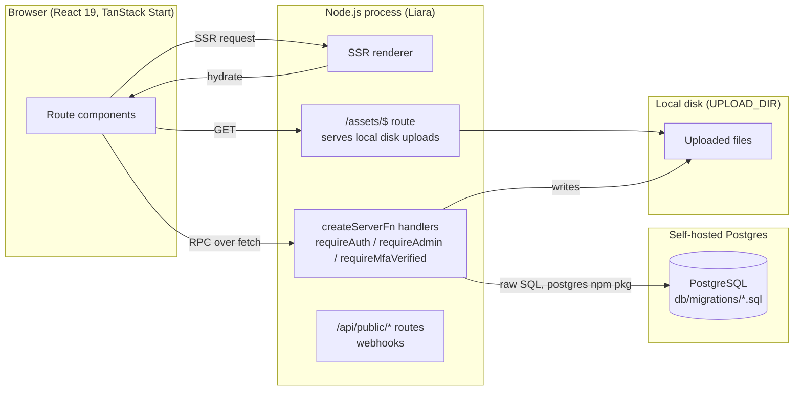
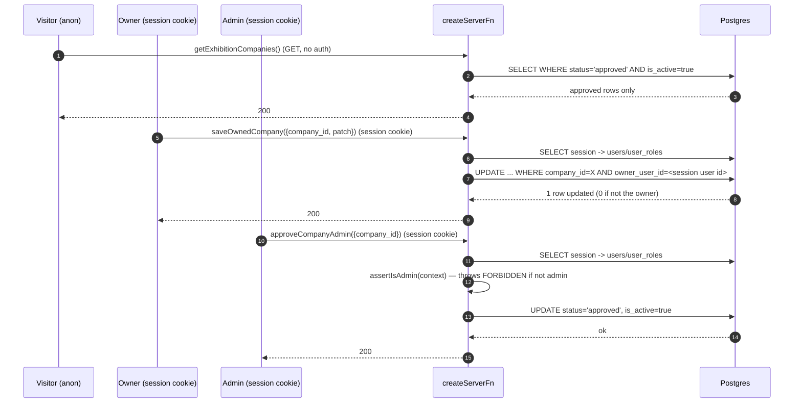
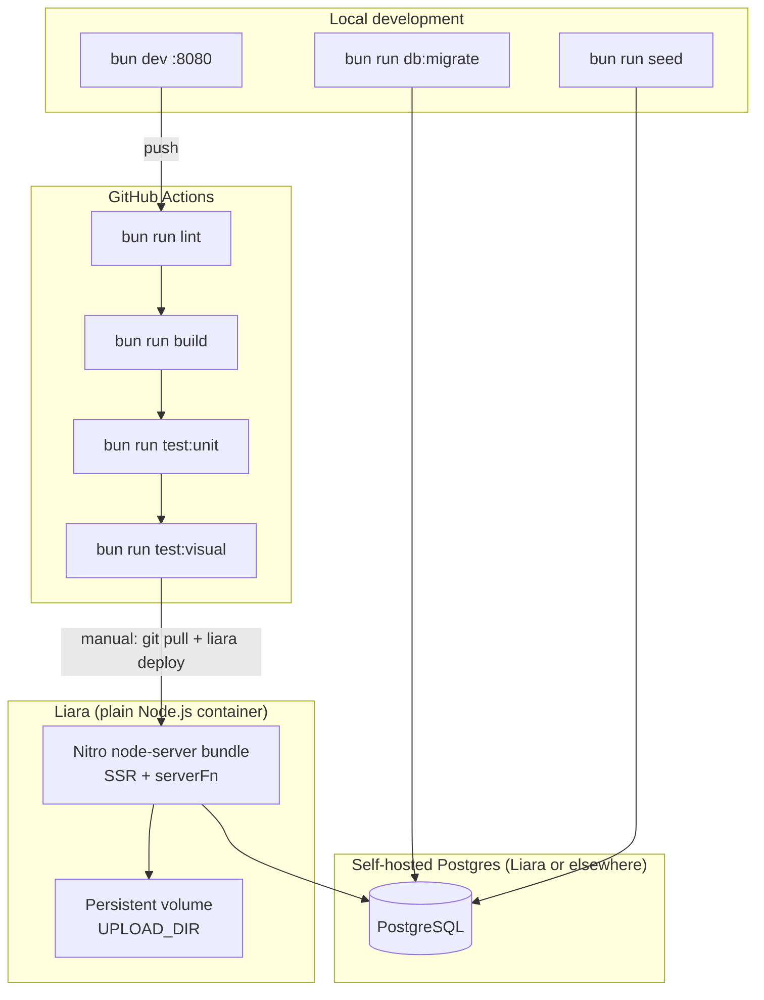
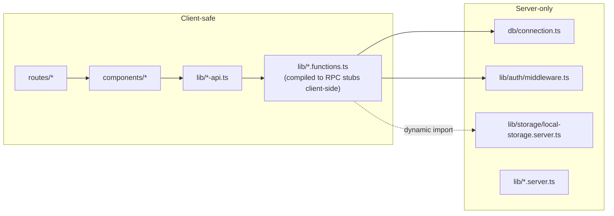
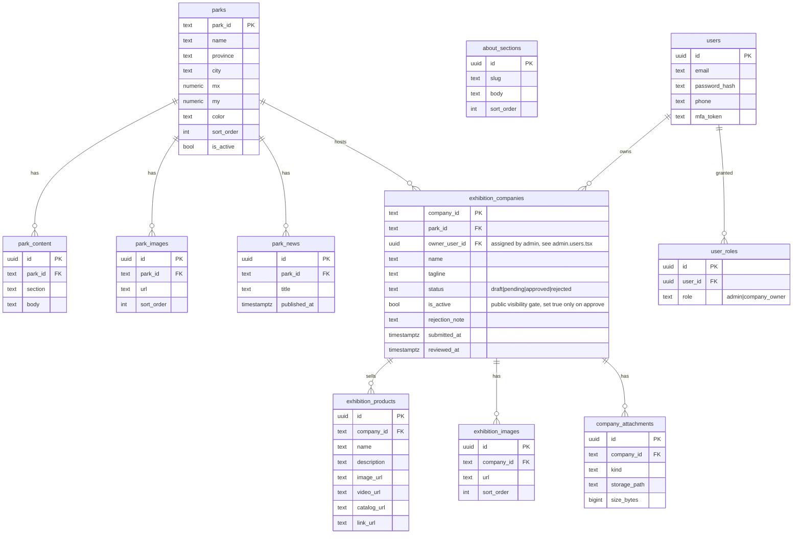
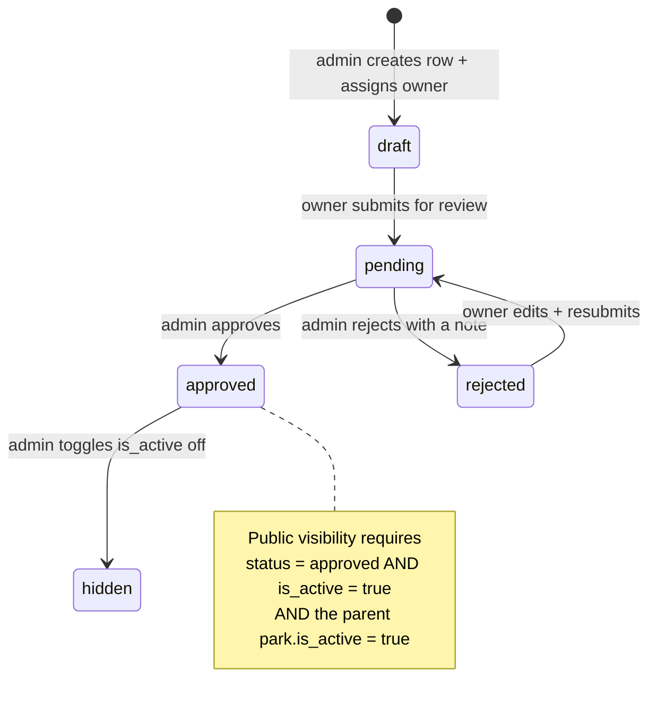
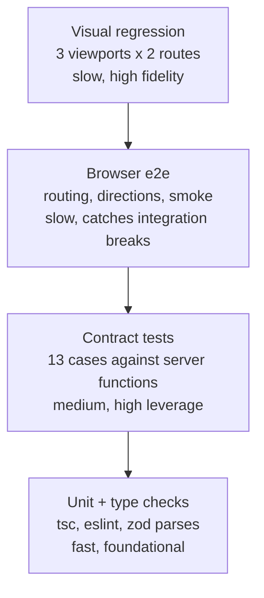
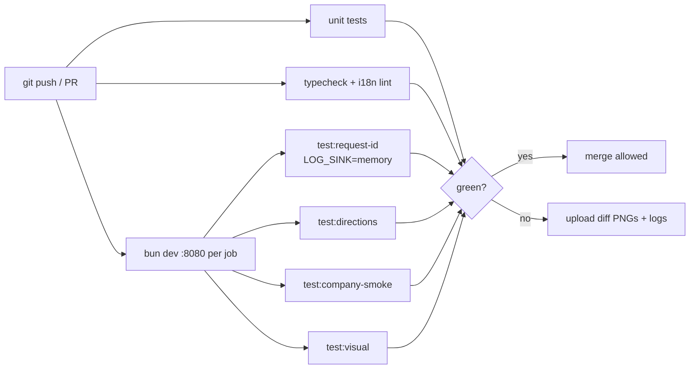
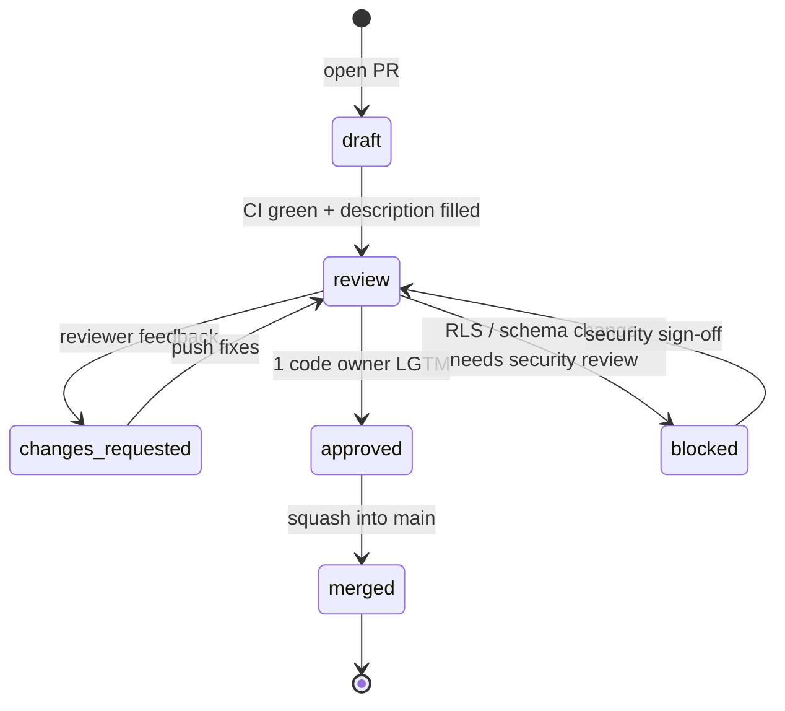

# کهکشان فاوا — پلتفرم نمایشگاه شرکت‌های فناور

پلتفرم عمومی برای معرفی پارک‌های علم و فناوری کشور، شرکت‌های مستقر در هر پارک،
و محصولات آن‌ها. سامانه یک بخش نمایش عمومی برای بازدیدکنندگان، یک داشبورد
مالک‌شرکت برای ثبت و ویرایش پروفایل، و یک کنسول مدیریتی برای بازبینی و انتشار
محتوا دارد.

مخاطبان این مستند دو گروه‌اند: توسعه‌دهنده‌ای که تازه به تیم می‌پیوندد و باید
پروژه را در چند ساعت روی ماشین خود بالا بیاورد، و توسعه‌دهنده‌ای که پس از چند
ماه می‌خواهد بخش جدیدی اضافه کند بدون اینکه قراردادهای موجود را بشکند.

---

## Table of Contents

- [Stack](#stack)
- [Getting Started](#getting-started)
- [Environment Variables](#environment-variables)
- [Architecture](#architecture)
- [Data Model](#data-model)
- [Security Model](#security-model)
- [Authentication & Company Onboarding](#authentication--company-onboarding)
- [API Reference](#api-reference)
- [Testing Strategy](#testing-strategy)
- [Deployment](#deployment)
- [Contributing](#contributing)
- [Non-Functional Requirements](#non-functional-requirements)
- [Operational Requirements](#operational-requirements)
- [Troubleshooting](#troubleshooting)


---

## Stack

Frontend runs on **TanStack Start** (React 19, Vite 7, file‑based routing).
Styling is **Tailwind CSS v4** via `@tailwindcss/vite`, with all tokens declared
in `src/styles.css`. Data lives in a **self-hosted PostgreSQL** instance
(schema + migration runner under `db/`, raw SQL via the `postgres` npm
package — no ORM). Auth is a self-hosted email/password + session-cookie
system (`src/lib/auth.functions.ts`, `src/lib/auth/*`) with optional SMS
2FA; there is no external auth provider. Uploaded files (logos, gallery
images, attachments) live on local disk under `UPLOAD_DIR`, served through
`src/routes/assets.$.ts`. Deployment target is **Liara, as a plain Node.js
container** (Nitro's `node-server` preset — see [Deployment](#deployment)
for why this differs from the Cloudflare-flavoured defaults in
`@lovable.dev/vite-tanstack-config`); edge functions are avoided for
internal logic in favour of `createServerFn`.

> **Migration note:** this project originally ran on Supabase (managed
> Postgres + PostgREST + Auth + Storage). It was migrated off Supabase
> entirely onto the self-hosted stack described above — see the git history
> for "Phase 1/5" through "Phase 4/5" commits if you need the old
> Supabase-era shape for reference. `supabase/migrations/*.sql` is kept only
> as a historical record of the old RLS policies; it is no longer applied
> anywhere and has no bearing on the current schema (`db/migrations/*.sql`
> is the live schema now).

We deliberately avoid several patterns:

- No `src/pages/`. Routes live under `src/routes/` — the Vite plugin regenerates
  `routeTree.gen.ts`.
- No authorization logic in the browser. Every write goes through a
  `createServerFn` in a `*.functions.ts` file, gated by `requireAuth` /
  `requireAdmin` / `requireMfaVerified` middleware (`src/lib/auth/middleware.ts`)
  that checks the session cookie against the `users`/`user_roles` tables —
  there is no RLS layer to fall back on, so every new write path must add
  its own explicit check.
- No database credentials or service-role keys in the browser bundle.
  `db/connection.ts` is only ever imported from server-only code paths.

---

## Getting Started

```bash
# 1. install
bun install

# 2. copy env and fill in DATABASE_URL (see next section) — you need a
#    local Postgres instance; `createdb parkfava_dev` after installing
#    Postgres locally is enough for development
cp .env.example .env

# 3. apply the schema
bun run db:migrate

# 4. seed sample parks, companies, and products
bun run seed

# 5. start the dev server (http://localhost:8080)
bun dev
```

The seed script is idempotent and prefixes every row with `[SEED]`, so you can
re‑run it or clear it with `bun run reset:dev`. Both talk to Postgres directly
via `postgres` — they were Supabase scripts until 2026-08-09 and had been
failing outright since that dependency was removed, which is why a fresh
checkout used to come up with no data.

Seeded content is deliberately not all publishable: alongside four approved
companies it creates one `pending` and one `draft`, which is what
`bun run test:api` uses to prove hidden rows stay hidden. Coordinates and the
long-form fields (founders, headcount, export potential) are filled in too, so
the map, the directions links and the assistant's grounding context all have
something real to work with.

> **After deploying, run `bun run db:migrate` on the server.** Migration
> `0004` adds the `search_text` columns the assistant queries; without it the
> assistant errors on every question.

### Available scripts

| Command                    | What it does                                                     |
| -------------------------- | ---------------------------------------------------------------- |
| `bun dev`                  | Vite dev server on port 8080                                     |
| `bun run build`            | Production build for Liara/Node (Nitro `node-server` preset)     |
| `bun run build:cloudflare` | Production build for Cloudflare Workers instead                  |
| `npm start`                | Run the built server across CPU cores (`node server/cluster.mjs`) |
| `bun run build:dev`        | Build with development mode flags (used by CI smoke tests)       |
| `bun run lint`             | ESLint over the whole tree                                       |
| `bun run seed`             | Insert local demo data (parks, companies, products)              |
| `bun run reset:dev`        | Delete rows tagged `[SEED]`                                       |
| `bun run test:unit`        | Vitest unit tests (i18n guards, URL/coordinate helpers)          |
| `bun run test:visual`      | Playwright screenshot diff for exhibition surfaces               |
| `bun run test:api`         | Contract tests against the server functions (visibility, auth, validation) |
| `bun run test:request-id`  | `x-request-id` propagation into handlers and log envelopes       |
| `bun run test:product-routing` | Smoke test for company/product URL scheme                    |
| `bun run test:directions`  | Directions links + copy-link payload carry the right coordinates |
| `bun run test:company-smoke` | Company profile renders in both languages with adequate contrast |

Every `test:*` above except `test:unit` needs a dev server on `:8080`; see
[Testing Strategy](#testing-strategy) for which also need seed data.

---

## Environment Variables

| Variable                        | Scope   | Purpose                                                             |
| ------------------------------- | ------- | ------------------------------------------------------------------- |
| `DATABASE_URL`                  | server  | Postgres connection string (`db/connection.ts`). Required. Append `?sslmode=require` for a managed/remote instance. |
| `UPLOAD_DIR`                    | server  | Local disk directory for uploaded files (`src/lib/storage/local-storage.server.ts`). Defaults to `./data/uploads`. On Liara this must be a mounted persistent disk. |
| `OPENROUTER_API_KEY`            | server  | Enables the AI assistant (`src/lib/assistant-ai.server.ts`). Unset ⇒ the assistant answers with a "not available right now" message instead of crashing. **Secret** — never prefix with `VITE_`. |
| `OPENROUTER_MODEL`              | server  | Model slug for the assistant. Defaults to `openai/gpt-4o-mini`.     |
| `WEB_CONCURRENCY`               | server  | Worker processes started by `server/cluster.mjs`. Defaults to the CPU count, capped at 4. Set `1` to run a single process. |
| `LOG_SINK`                      | server  | Set to `memory` to retain log envelopes in an in-memory ring buffer for `/api/public/debug-echo`. Required by `bun run test:request-id`. Never enable in production. |
| `CSP_ENFORCE`                   | server  | Send `content-security-policy` instead of the report-only header (`src/lib/csp.ts`). |
| `VITE_LOVABLE_CONNECTOR_GOOGLE_MAPS_BROWSER_KEY` | client | Managed Maps JS key; valid only on `*.lovable.app` / `*.lovableproject.com` |
| `VITE_GOOGLE_MAPS_DEV_KEY`      | client  | Optional developer key so Google Maps also renders on `localhost`   |
| `MFA_ENFORCED`                  | server  | Set to `true` to require SMS-OTP on every login (all users). Unset/anything else = off. See `src/lib/auth/middleware.ts` |
| `SMS_PROVIDER`                  | server  | `kavenegar` \| `melipayamak` \| `ghasedak` — required for `MFA_ENFORCED=true` to actually deliver codes; see `src/lib/sms/send-sms.server.ts` |
| `SMS_API_KEY`                   | server  | API key for the chosen `SMS_PROVIDER`                                |
| `SMS_SENDER_LINE`               | server  | Optional sender line number some panels require                     |

Rules:

- Never expose `DATABASE_URL` to the client — it's only ever read inside
  `db/connection.ts`, imported exclusively from server-only code paths.
- Server-only variables are read inside handler bodies, not at the top level
  of files that are also part of the client bundle.

- Secrets belong in the local `.env` (gitignored) and in Liara's Environment
  Variables panel. `OPENROUTER_API_KEY` in particular guards a paid API — a
  leaked key is someone else's bill.

No Supabase env vars are read by the application anymore — see the migration
note above. One dead script is the exception: `scripts/seed-attachments.ts`
still reads `SUPABASE_URL` / `SUPABASE_SERVICE_ROLE_KEY` and imports
`@supabase/supabase-js`, which is no longer a dependency, so it cannot run at
all. It is not referenced by any `package.json` script; treat it as pending
deletion or a rewrite onto `db/connection.ts` (as `seed-dev-data.ts` and
`reset-dev-data.ts` already received).

### Maps in local development

The managed Google key is referrer-restricted to Lovable domains, so on
`localhost` it would return `RefererNotAllowedMapError`. The company map handles
this in two layers:

1. **Optional dev key.** Create a key in Google Cloud → *APIs & Services →
   Credentials*, enable **Maps JavaScript API**, and add these HTTP referrers:
   `http://localhost:8080/*` and `http://127.0.0.1:8080/*`. Put it in your local
   `.env` as `VITE_GOOGLE_MAPS_DEV_KEY=...` (never commit a real key). The map
   then behaves exactly as in production.
2. **Keyless fallback.** Without a dev key — or if Google rejects the referrer
   (`gm_authFailure`) — the component silently renders a Leaflet /
   OpenStreetMap map with the same marker, popup and `data-testid`, so local
   development never shows a map error.


---

## Architecture

The platform is split into three logical planes: a **public read plane** that
serves anonymous visitors, an **owner write plane** for company profiles, and
a **privileged control plane** for admin workflows. Unlike the old
Supabase/RLS setup, there is no database-level policy layer — every plane's
access rules are enforced explicitly in `createServerFn` middleware
(`src/lib/auth/middleware.ts`), since the browser never talks to Postgres
directly.

### System context



### Request flow

Authorization is a single chain per request: session cookie → `users`/`user_roles` lookup → role check in middleware — no separate policy layer to reason about.



### Deployment topology



Despite the Cloudflare-flavoured naming in `@lovable.dev/vite-tanstack-config`
(the project's origin), production actually runs as a **plain Node.js
process** on Liara — see [Deployment](#deployment) for why, and why that
default lives in `vite.config.ts` rather than an env var.

### Route layout

```
src/routes/
├── __root.tsx              — shell, head, providers, <Outlet />
├── index.tsx               — landing page
├── about.tsx               — public about page
├── auth.tsx                — sign-in / sign-up flows
├── exhibition.tsx          — public grid of approved companies
├── company.$id.index.tsx   — company profile (SSR + share metadata)
├── company.$id.product.$pid.tsx — product detail (canonical share URL)
├── kahkeshan.tsx           — 3D park map (client-only vendor bundle)
├── parks.tsx               — public list of parks
├── my-company.tsx          — owner dashboard (requires auth); fill in
│                             company info and submit for admin review
├── register-company.tsx    — static page: company sign-up is admin-only,
│                             this just tells visitors to email the admin
├── admin.exhibition.tsx    — admin review console (approve / reject)
├── admin.users.tsx         — grant admin role; assign a company to a user
│                             (see Authentication & Company Onboarding)
├── admin.parks.tsx         — park CRUD + reorder
├── admin.kahkeshan.tsx     — park layout editor
├── admin.attachments.tsx   — attachment moderation
└── admin.about.tsx         — CMS for the about page
```

Filename dots become URL slashes; `$id` is a dynamic segment. Never edit
`src/routeTree.gen.ts` — the Vite plugin regenerates it.

### Module boundaries



`createServerFn`'s build-time compiler strips each handler body out of the
client bundle, leaving only a thin RPC stub — so `*.functions.ts` files can
safely import `db/connection.ts` (which imports the `postgres` npm package,
a Node-only dependency) at the top level. A plain `.ts`/`.tsx` file that
isn't wrapped in `createServerFn` (e.g. `lib/*-api.ts`) must never import
server-only code directly — that's why upload helpers use
`await import("./storage/local-storage.server")` inside the handler instead
of a static top-level import; a static import into the client graph fails
the build with an "import denied in client environment" error.


---

## Data Model

### Entity relationship diagram



### Company workflow state machine

There is no public self-signup for companies — `/register-company` is a
static page that tells visitors to email the admin team. An admin always
creates the company row and assigns its owner first (`/admin/users`); only
then can that user log in and fill in the profile. Full step-by-step in
[Authentication & Company Onboarding](#authentication--company-onboarding).

`status` and `is_active` are independent on purpose: an admin can hide an
approved company (`is_active = false`) without losing its review trail
(`status` stays `approved`).



### Table catalogue

| Table                  | Purpose                                                       | Key relationships                                |
| ---------------------- | ------------------------------------------------------------- | ------------------------------------------------ |
| `parks`                | Top-of-hierarchy science parks; drives the `kahkeshan` map    | 1..N with content/images/news/companies          |
| `park_content`         | CMS blocks (about, contacts) per park                         | N..1 `parks`                                     |
| `park_images`          | Gallery slots per park                                        | N..1 `parks`                                     |
| `park_news`            | Announcements shown on the park detail                        | N..1 `parks`                                     |
| `exhibition_companies` | Company profile with `status` + `is_active` workflow          | N..1 `parks`, N..1 `users` (owner)          |
| `exhibition_products`  | Products under a company; canonical share URL                 | N..1 `exhibition_companies`                      |
| `exhibition_images`    | Media slots per company                                       | N..1 `exhibition_companies`                      |
| `company_attachments`  | Uploaded files (brochures, certificates) on local disk, served via `/assets/*` | N..1 `exhibition_companies`      |
| `about_sections`       | CMS blocks for `/about`                                       | standalone                                       |
| `users`                | Accounts: email, password hash, MFA/OTP state                 | 1..N `user_roles`, `sessions`                    |
| `user_roles`           | Role assignments; separated to prevent privilege escalation   | N..1 `users`                                |
| `sessions`             | Opaque server-side session tokens; deleting a row revokes access instantly | N..1 `users`                        |
| `rate_limit_hits`      | One row per accepted call to a throttled endpoint; in Postgres so the limit holds across workers and restarts | standalone |
| `_migrations`          | Applied migration filenames, written by `db/migrate.ts`       | standalone                                       |

### Data lifecycle algorithm

The canonical rule enforced by RLS and the review console:

```text
public visible(company) :=
  company.status = 'approved'
  AND company.is_active = true
  AND EXISTS park WHERE park.park_id = company.park_id
                    AND park.is_active = true
```

Any read that violates this predicate is stripped by the anon SELECT policy —
the client cannot re-introduce hidden rows by guessing IDs.


---

## Security Model

There is no database-level policy layer (no RLS, no PostgREST roles) —
Postgres itself trusts every query that reaches it, connected via a single
app-level credential (`DATABASE_URL`). All authorization instead happens in
`createServerFn` middleware before a query is ever issued. This means: **any
new read or write path must add its own explicit check** — there is no
fallback safety net at the database layer if a server function forgets to
call one.

### The middleware chain (`src/lib/auth/middleware.ts`)

| Middleware            | Checks                                                              |
| ---------------------- | -------------------------------------------------------------------- |
| `requireAuth`          | Session cookie → `sessions` table → not expired → attaches `context.user` (id, email, phone, `roles: string[]`, `mfaVerified`) |
| `requireAdmin`         | `requireAuth`, then `context.user.roles.includes("admin")`           |
| `requireMfaVerified`   | `requireAuth`, then (only if `MFA_ENFORCED=true`) `context.user.mfaVerified` |

Individual `*.functions.ts` files layer their own checks on top of these —
e.g. `assertIsAdmin(context)` / `assertCanEditCompany(sql, context, company_id)`
helpers in `exhibition-api.functions.ts` that also allow the row's owner,
not just admins.

### Access matrix

Read this row-by-row: "principal P on table T may perform operations O,
enforced by which server function."

| Table                  | Anonymous                       | Owner (session cookie)                        | Admin |
| ---------------------- | -------------------------------- | ----------------------------------------------- | ----- |
| `parks`                | read (all — public per design)   | read                                             | full via `parks.functions.ts` |
| `park_content`/`park_images`/`park_news` | read (all)      | read                                             | full via `park-content.functions.ts` |
| `exhibition_companies` | read only `status='approved' AND is_active=true` (`getExhibitionCompanies`/`getExhibitionCompanyDetail`) | read+update own row via `saveOwnedCompany`/`getMyCompany` (cannot set `status`/`is_active`/`owner_user_id` — stripped server-side) | full including `status` transitions and assigning `owner_user_id` (`admin-users.functions.ts`) |
| `exhibition_products`/`exhibition_images` | read only for approved+active parent company | full on own company (`assertCanEditCompany`) | full |
| `company_attachments`  | read only `is_active=true` (`getAttachments`) | none directly — admin-managed          | full (`attachments.functions.ts`) |
| `about_sections`       | read (all)                       | read                                             | full via `about-sections.functions.ts` |
| `user_roles`           | none                              | own roles only (`getMyRoles`, returns `context.user.roles`) | grant/revoke via `admin-users.functions.ts` (self-revoke blocked) |

Owner writes cannot set `status='approved'` — those fields are destructured
out of the patch object server-side in `saveOwnedCompany`, not merely hidden
in the UI. Only `approveCompanyAdmin`/`rejectCompanyAdmin` (admin-gated) can
move a row into or out of `approved`.

> **A real bug this shape catches**: the initial Postgres migration missed
> the `status='approved' AND is_active=true` filter on `getExhibitionCompanyDetail`
> and `getPublicExhibitionProducts` — since there's no RLS to fall back on,
> that meant anyone could read a draft/rejected company's full record by
> `company_id`. Fixed, but it's the canonical example of why every read
> path needs its own explicit check now, not just writes.

### Verifying authorization locally

There's no PostgREST/RLS simulation anymore — verify server functions the
same way you'd verify any authenticated API: drive them over real HTTP with
real session cookies. The pattern used throughout this migration (see git
history) was a temporary `src/routes/dev.*.tsx` test route exercising the
target server functions via `useServerFn`, driven by a small Playwright
script, then deleted before shipping. For direct SQL inspection during
development:

```sql
-- Confirm a company is correctly hidden from public view.
SELECT company_id, status, is_active FROM exhibition_companies
WHERE company_id = 'some-draft-company';
-- then separately confirm getExhibitionCompanyDetail({data:{id:'some-draft-company'}})
-- returns {company: null, ...} when called with no session.
```

### Security checklist for PRs touching schema or server functions

1. Every new `createServerFn` that reads or writes anything non-public has
   an explicit middleware (`requireAuth`/`requireAdmin`/`requireMfaVerified`)
   or an inline ownership check — there is no RLS to catch a missed one.
2. Every new **read** path that returns rows with a draft/private state
   (anything with a `status`, `is_active`, or ownership column) filters that
   state explicitly, even if it feels redundant with a caller that "should"
   already be passing filtered input — the server function is the trust
   boundary, not the caller.
3. Dynamic column lists built from parsed input (the `sql(patch, ...cols)`
   pattern used throughout `*.functions.ts`) must come from a zod schema
   *without* `.passthrough()`/`.strict()` bypass, so unknown keys are
   silently dropped rather than reaching the query as arbitrary column
   names.
4. Sensitive columns are omitted from public-facing query results rather
   than filtered client‑side.

### Granting the admin role

Admin-only routes (`/admin/*`) require a row in `user_roles` with
`role = 'admin'` for the signed-in user. If the admin panel shows an empty
list or a "no admin role" screen, the current account has not been granted
the role. Sign up via `/auth`, copy the `User ID` shown on the
"no access" screen, then run:

```sql
INSERT INTO user_roles (user_id, role)
VALUES ('<user-uuid>', 'admin')
ON CONFLICT (user_id, role) DO NOTHING;
```

The first user who ever signs up is auto-promoted to admin by the
`assign_first_user_admin` trigger (`db/migrations/0001_init.sql`); every
subsequent admin must be granted explicitly (SQL above, or the "تبدیل به
ادمین" button on `/admin/users` once you have one admin account).

---

## Authentication & Company Onboarding

### How users sign in

`/auth` (`src/routes/auth.tsx`) is the only sign-in surface, shared by every
role — there's no separate admin login page, and no third-party auth
provider. **Email + password only** — `signUp`/`signIn` in
`src/lib/auth.functions.ts` hash the password with `scrypt`
(`src/lib/auth/password.server.ts`) and set an opaque, random, HttpOnly
session cookie (`src/lib/auth/session.server.ts`) backed by a `sessions`
table row; there is no JWT to decode or refresh, and revoking a session is a
single `DELETE`. Google/OAuth sign-in existed in the Supabase-era version of
this app and was intentionally dropped during the migration rather than
rebuilt — there is no OAuth path today.

There is no separate "admin login" — a signed-in user's **capabilities**
come entirely from rows in `user_roles`:

| Role            | Grants                                                          | How it's granted |
| --------------- | ---------------------------------------------------------------- | ----------------- |
| `admin`         | Every `/admin/*` route; approve/reject companies; grant roles    | First signup is auto-admin (`assign_first_user_admin` trigger); every other admin via SQL (see above) or the "تبدیل به ادمین" button on `/admin/users` (an existing admin promotes another user) |
| `company_owner` | `/my-company`; edit only the one company they're assigned to     | An admin picks their company from a dropdown on `/admin/users` (`assignCompanyOwner`) — this also upserts the `company_owner` role automatically |
| *(none)*        | Public pages only                                                 | Default for any signed-up user until an admin does one of the above |

### Optional: SMS two-step verification

A second factor (phone number + SMS code) can be required on every login,
for every user, regardless of role — implemented in `src/lib/mfa.functions.ts`,
gated by `requireMfaVerified` in `src/lib/auth/middleware.ts`. It ships
**off by default** so it doesn't affect anyone until deliberately turned on:

1. Get an account + API key with a supported SMS panel (`kavenegar`,
   `melipayamak`, or `ghasedak` — see `src/lib/sms/send-sms.server.ts`;
   double-check the request shape against the panel's current docs before
   relying on it, since it hasn't been exercised against a live account).
2. Set `SMS_PROVIDER`, `SMS_API_KEY` (and `SMS_SENDER_LINE` if the panel
   needs one) as app env vars (see [Environment Variables](#environment-variables)).
3. Set `MFA_ENFORCED=true`.

Once enforced, every login is followed by a phone step (first time) or a
6-digit SMS code (returning sessions) before the user can reach anything
behind `requireMfaVerified` — currently every admin and company-owner
server function. Phone/OTP state lives in dedicated columns on the `users`
table (`db/migrations/0001_init.sql` + `0003_mfa_columns.sql`) — this used
to live in Supabase Auth's `user_metadata` JSON blob before the migration.
The MFA status check fails open (falls back to normal login) if it errors,
by design — a bug in this path must not be able to lock out every admin.

### How a company gets onto the exhibition — step by step

**There is no public "sign up your company" form.** `/register-company` is a
static page that tells visitors to email the admin team — self-service
company creation existed in the Supabase-era codebase (`createOwnedCompany`)
but was already dead code (no route ever called it, since the RLS policy
that would have allowed it had been dropped) and was removed during the
migration.

1. **Admin creates the company shell.** `/admin/exhibition` → "+ افزودن شرکت
   جدید" → pick a `company_id` slug. This starts life as `status: 'draft'`,
   `is_active: false` — invisible on the public site.
2. **Admin assigns the owner.** `/admin/users` → find the user's row (they
   must have already signed up once via `/auth`) → pick the company from the
   dropdown in the "شرکت" column. This sets `owner_user_id` on the company
   row and grants that user the `company_owner` role.
3. **Owner fills in their profile.** The owner signs in → `/my-company` →
   fills in identity, contact info, description, uploads a logo, adds
   products, gallery images, catalog/video. They can save drafts repeatedly;
   nothing is public yet. (Admins can also edit any company directly from
   `/admin/exhibition`.)
4. **Owner submits for review.** The "ارسال برای بررسی" button
   (`submitCompanyForReview`) sets `status: 'pending'`. The owner cannot set
   `status`, `is_active`, or `owner_user_id` themselves — those fields are
   destructured out of the patch object *server-side*, in
   `saveOwnedCompany` (`src/lib/exhibition-api.functions.ts`), not merely
   hidden in the UI — a malicious client sending those fields directly still
   can't set them.
5. **Admin reviews.** `/admin/exhibition`, filterable by status
   (در انتظار / تاییدشده / پیش‌نویس / رد شده):
   - **"تایید و انتشار"** (`approveCompanyAdmin`) → `status: 'approved'`,
     `is_active: true`. The company is now publicly visible (also requires
     its parent park to have `is_active: true`).
   - **"رد کردن…"** (`rejectCompanyAdmin`) → `status: 'rejected'` with a required
     reason (`rejection_note`), shown to the owner on `/my-company`. The
     owner can edit and resubmit, which goes straight back to `pending`.
   - An admin can later flip `is_active` off on an already-approved company
     (e.g. the checkbox on `/admin/exhibition`) to hide it without losing
     the approval/review trail.

---

## API Reference

There is no PostgREST — the only API surface is `createServerFn` RPCs,
grouped by domain into `src/lib/*.functions.ts` files. Client-facing
`src/lib/*-api.ts` files are thin wrappers around them: they exist so the
many call sites across `src/routes/` and `src/components/` didn't need to
change function names/signatures when the migration moved the underlying
implementation off Supabase, and so upload helpers can build the `FormData`
payload before calling the server function.

### Companies (`src/lib/exhibition-api.functions.ts`)

| Function                          | Method | Auth                          | Purpose                                          |
| ---------------------------------- | ------ | ------------------------------ | ------------------------------------------------- |
| `getExhibitionCompanies`           | GET    | none                            | List `status='approved' AND is_active=true`       |
| `getExhibitionCompanyDetail`       | GET    | none (checks session if not public) | Single company + images + products; public if approved+active, otherwise owner/admin only |
| `getPublicExhibitionProducts`      | GET    | none                            | Products for a list of company ids, joined against publish state |
| `getMyCompany`                     | GET    | `requireAuth`                   | The signed-in user's own company (any status)     |
| `saveAdminCompany`                 | POST   | `requireMfaVerified` + admin    | Upsert any company by `company_id`                |
| `listAdminCompanies`               | GET    | `requireMfaVerified` + admin    | All companies, any status                         |
| `saveOwnedCompany`                 | POST   | `requireMfaVerified` + owner    | Partial update on own company (status/is_active/owner_user_id stripped) |
| `submitCompanyForReview`           | POST   | `requireMfaVerified` + owner/admin | `status → 'pending'`                           |
| `approveCompanyAdmin`/`rejectCompanyAdmin` | POST | `requireMfaVerified` + admin | `status → 'approved'`/`'rejected'`             |
| `deleteExhibitionCompanyAdmin`/`reorderExhibitionCompaniesAdmin` | POST | `requireMfaVerified` + admin | delete / bulk `sort_order` update |
| `addExhibitionImage`/`deleteExhibitionImage`/`updateExhibitionImage`/`reorderExhibitionImages` | POST | `requireMfaVerified` + owner/admin | image CRUD, ownership checked via parent company |
| `upsertExhibitionProduct`/`deleteExhibitionProduct`/`reorderExhibitionProducts` | POST | `requireMfaVerified` + owner/admin | product CRUD |
| `uploadExhibitionAssetFn`          | POST (FormData) | `requireMfaVerified` + owner/admin | Upload a logo/gallery image to local disk |

### AI assistant (`src/lib/assistant.functions.ts`)

| Function        | Method | Auth | Purpose                                                    |
| --------------- | ------ | ---- | ----------------------------------------------------------- |
| `askAssistant`  | POST   | none — **rate limited** | Answer a visitor's question, grounded in live exhibition data |

Public and unauthenticated by design, and it spends money on every call, so
the throttle runs *before* any database or OpenRouter work: 15 requests per
5 minutes per caller, plus a global ceiling of 300/hour that bounds the worst
case under a distributed flood. Both are enforced by
`src/lib/rate-limit.server.ts` against the `rate_limit_hits` table.

The handler shortlists at most 20 candidate companies in Postgres (see
[Performance & Scaling](#performance--scaling)), ranks them in Node, and hands
the model only those rows as ground truth — with instructions never to invent
details about a company in this exhibition, while still answering from general
knowledge when the question is broader than the data. Returns
`{ answer, companyIds }`; the client turns `companyIds` into clickable chips.

With `OPENROUTER_API_KEY` unset the function throws `AI_NOT_CONFIGURED` and
the UI shows a friendly message — the assistant degrades, the page does not
break.

### Parks / park content (`src/lib/parks.functions.ts`, `src/lib/park-content.functions.ts`)

`getParks`/`getActiveParks`/`getParkContent` are all public reads (no auth —
parks have no draft/private state). Every write (`upsertParkAdmin`,
`deleteParkAdmin`, `reorderParksAdmin`, `upsertParkContentAdmin`,
`addParkImageAdmin`/`deleteParkImageAdmin`, `upsertParkNewsAdmin`/
`deleteParkNewsAdmin`, `uploadParkAssetFn`) is `requireMfaVerified` + admin.

### Attachments (`src/lib/attachments.functions.ts`)

| Function                | Method | Auth                        | Purpose |
| ------------------------ | ------ | ----------------------------- | ------- |
| `getAttachments`         | GET    | none                           | Only `is_active=true` rows for one owner |
| `getAttachmentsAdmin`/`getAllAttachmentsAdmin` | GET | `requireMfaVerified` + admin | Every row (incl. inactive), the latter with dynamic filters |
| `uploadAttachmentFn`     | POST (FormData) | `requireMfaVerified` + admin | Upload + insert row |
| `updateAttachmentAdmin`/`deleteAttachmentAdmin`/`reorderAttachmentsAdmin` | POST | `requireMfaVerified` + admin | edit/delete/reorder |

### About sections (`src/lib/about-sections.functions.ts`)

`getAboutSections` is a public read (no draft state). `upsertAboutSectionAdmin`/
`deleteAboutSectionAdmin`/`uploadAboutAssetFn` are `requireMfaVerified` + admin.

### Auth & admin users (`src/lib/auth.functions.ts`, `src/lib/admin-users.functions.ts`, `src/lib/mfa.functions.ts`)

`signUp`/`signIn`/`signOutFn`/`getCurrentUser` are the whole auth surface
(see [Authentication & Company Onboarding](#authentication--company-onboarding)).
`listUsers`/`grantAdmin`/`revokeAdmin`/`assignCompanyOwner` are admin-only;
`getMyRoles` returns the caller's own roles. `getMfaStatus`/`setPhone`/
`requestOtp`/`verifyOtp` implement the optional SMS 2FA flow.

### Conventions for adding a new server function

- File goes under `src/lib/*.functions.ts`, one domain per file.
- Every export uses `createServerFn({ method: "GET" | "POST" })`.
- Every non-public read or any write gets `.middleware([requireAuth])` /
  `.middleware([requireMfaVerified])` at minimum, plus an inline
  `assertIsAdmin(context)` / ownership check inside the handler where the
  row belongs to a specific user.
- Validate input with a zod schema via `.inputValidator(...)` — never
  `.passthrough()`/`.strict()` bypass a schema that feeds a dynamic
  `sql(patch, ...cols)` call (see [Security Model](#security-model)).
- File uploads use `.inputValidator((raw) => { if (!(raw instanceof FormData)) throw ...; ... })`
  and are called client-side with `{ data: someFormData }` — the framework
  auto-detects `FormData` and sends `multipart/form-data`.

---

## Testing Strategy

| Suite                       | What it proves                                                                 | Needs |
| --------------------------- | ------------------------------------------------------------------------------ | ----- |
| `bun run test:unit`         | Pure logic — i18n guards, URL/coordinate helpers                                | nothing |
| `bun run test:api`          | Contracts: anonymous reads expose only approved+active rows, unauthenticated writes are rejected and change nothing, zod rejects malformed input | server + seed |
| `bun run test:request-id`   | `x-request-id` propagates into handlers and log envelopes, including across `await` boundaries | server + `LOG_SINK=memory` |
| `bun run test:product-routing` | `/company/:id/product/:pid` links navigate, render, and survive a reload      | server + seed |
| `bun run test:directions`   | Directions links and the copy-link payload carry the right coordinates          | server + seed |
| `bun run test:company-smoke`| Company profile renders in both languages with adequate heading contrast         | server + seed |
| `bun run test:visual`       | Pixel diffs across three viewports for the company/product pages                | server + seed |

"server" means a dev server on `:8080`; "seed" means `bun run seed` has been
applied, since the contract assertions depend on the seeded draft/pending
companies existing in order to prove they stay hidden.

Two rules that keep these honest, both learned the hard way here:

- **A test that cannot fail is worse than no test.** The contract suite used to
  target PostgREST with a Supabase key and skipped itself when those env vars
  were missing — so after the Postgres migration it passed as a silent no-op
  for months. When changing a suite, verify it still fails against a deliberate
  regression before trusting it.
- **An absence assertion must first prove the call succeeded.** "id not in
  response" also passes when the response is an error. `test-api-contracts.py`
  routes those checks through a helper that rejects an errored body first.

A change that alters the DOM of the company or product page must either
preserve pixel output or update baselines in the same PR. A change to
visibility rules (`status` / `is_active` handling) or to auth middleware must
be reflected in `scripts/test-api-contracts.py`.

### Test pyramid



### CI pipeline

`.github/workflows/ci.yml` runs these as parallel jobs; each e2e job starts
its own dev server first.



`test:api` and `test:product-routing` are not wired into CI yet — they need a
seeded database, which the workflow does not currently provision. Run them
locally against a seeded dev server.

---

## Deployment

Production runs on **Liara** as a plain Node.js container — **not**
Cloudflare Workers, despite `@lovable.dev/vite-tanstack-config` defaulting
Nitro to a `cloudflare-module` build. `vite.config.ts` pins the Nitro preset
to `node-server` unconditionally (Liara's buildpack doesn't forward env vars
to the build step, so gating this behind an env var silently fell back to
the Cloudflare preset in practice — see the comment there). `npm run
build:cloudflare` still exists if this project is ever actually pointed at
Cloudflare.

There is **no automated deploy step**. `liara deploy` uploads from whatever
is checked out in the *local* directory it's run from — merging a PR on
GitHub does not, by itself, change what's live. Every release is:

```
git pull origin main
liara deploy
```

run manually, from a clone that's up to date with `main`, followed by
`bun run db:migrate` against the production `DATABASE_URL` whenever the
release adds a migration.

The container starts `server/cluster.mjs`, not the Nitro entry directly, so
the app uses every core rather than one (`WEB_CONCURRENCY` to override, `1` to
opt out). The Dockerfile's `HEALTHCHECK` polls `/api/public/health`, which
runs `SELECT 1` — a process that is listening but cannot reach Postgres is
reported unhealthy rather than passing a port check while serving errors.

### Postgres and file storage on Liara

Unlike the old Supabase setup, this app now needs two pieces of
infrastructure you provision yourself:

1. **A Postgres instance.** Liara offers managed Postgres databases — create
   one, set `DATABASE_URL` (with `?sslmode=require` if Liara requires TLS)
   as an app env var, then run `bun run db:migrate` once against it (from a
   machine that can reach it — e.g. `DATABASE_URL=... bun run db:migrate`
   locally, or as a one-off Liara shell command) to apply everything under
   `db/migrations/*.sql`. Migrations are idempotent and tracked in a
   `_migrations` table, so re-running is always safe — only unapplied files
   run.
2. **A persistent disk for `UPLOAD_DIR`.** Liara's container filesystem is
   ephemeral across redeploys — without a mounted disk, every uploaded
   logo/image/attachment disappears on the next `liara deploy`. Provision a
   disk in the Liara dashboard, mount it at the path you set `UPLOAD_DIR`
   to, before the first real upload happens in production.

Migrations live under `db/migrations/*.sql`, applied in filename order by
`bun run db:migrate` (`db/migrate.ts`). Never edit an applied migration —
write a new one that alters the previous state.

> **Cutover status: done, with one gap.** The app is live on Liara at
> `https://favapark.liara.run`. `db:migrate` has been run against the
> production `parkfava-db`, and all content data — parks, exhibition
> companies, products, images, attachments, about-sections — was pulled
> from the old Supabase project via its REST API (using the
> `SUPABASE_URL`/`SUPABASE_PUBLISHABLE_KEY` anon key, since a direct
> Postgres connection string was never obtainable through Lovable Cloud's
> UI) and inserted into the new Postgres instance. Every file referenced by
> those rows was downloaded from the old `park-assets` bucket and written
> to the production `UPLOAD_DIR` disk from inside a `liara shell` session
> (plain Node `fetch`/`fs`, no dependencies — the deploy container only
> ships the built `.output`, not the full source tree or `bun`).
>
> **Still outstanding:** real user accounts (company owners) were not
> migrated — the old Supabase Auth password hashes are bcrypt-based and
> incompatible with this app's own `scrypt` hashing (see
> `src/lib/auth/password.server.ts`), so there is no safe way to carry a
> login over. Only a fresh admin account exists today. Company owners will
> need to sign up again (and be manually linked to their existing
> `exhibition_companies` row via `owner_user_id`, or through a self-serve
> claim flow if one gets built) before they can self-manage their listing.

### Release flow (as it actually works today)

```mermaid
sequenceDiagram
  participant Dev
  participant GH as GitHub
  participant CI as Actions
  participant Op as Operator (local machine)
  participant Liara
  participant PG as Postgres (Liara)
  Dev->>GH: push feat/*, open PR
  GH->>CI: trigger workflow (lint/build/tests)
  CI-->>GH: status (best-effort; CI runner assignment has been flaky here)
  Dev->>GH: merge to main
  Note over GH,Op: nothing deploys automatically here
  Op->>GH: git pull origin main
  Op->>PG: bun run db:migrate (only if new migrations exist)
  Op->>Op: liara deploy (uploads local working directory)
  Op->>Liara: new Docker/Node build + restart
  Liara-->>PG: connects at runtime via DATABASE_URL
  Liara-->>Liara: reads/writes UPLOAD_DIR on the mounted disk
```

---

## Contributing

Branches are named `feat/<slug>`, `fix/<slug>`, or `chore/<slug>`. Commits
follow Conventional Commits (`feat:`, `fix:`, `refactor:`, `docs:`, `test:`).
One logical change per PR.

### PR lifecycle




### Code review checklist

- [ ] Schema changes include GRANTs, RLS, and a contract test update.
- [ ] New routes ship `errorComponent` and `notFoundComponent`.
- [ ] Server functions read secrets inside `.handler()`, not at module scope.
- [ ] `client.server.ts` is imported dynamically, not at the top of a file the
      browser can reach.
- [ ] User‑facing text is in Persian; internal identifiers stay ASCII.
- [ ] Visual baselines updated or explicitly justified.

### Ownership map

| Area                            | Primary reviewer            |
| ------------------------------- | --------------------------- |
| Public exhibition surfaces      | Frontend lead               |
| Admin console & workflow        | Backend lead                |
| RLS policies & migrations       | Backend lead + security     |
| 3D map (`kahkeshan`)            | Frontend lead               |
| CI, scripts, tooling            | Platform                    |

---

## Non-Functional Requirements

الزامات کیفی که هر Pull Request باید رعایت کند. نقض این قوانین در code review مسدود می‌شود.

### Compliance checklist

قبل از merge، این چک‌لیست باید سبز باشد. هر مورد قرمز → PR مسدود.

| Requirement                        | Threshold                                  | Enforced by                              |
| ---------------------------------- | ------------------------------------------ | ---------------------------------------- |
| Client bundle (initial, gzip)      | ≤ 200 KB                                   | `bun run build` + `du -sh dist/client/assets/*.js` |
| LCP (mobile, throttled 4G)         | ≤ 2.5 s                                    | Lighthouse CI in `playwright.yml`         |
| Edge TTFB (public read)            | ≤ 100 ms p75                               | Cloudflare Analytics                      |
| Server function p95 latency        | ≤ 300 ms                                   | Logflare query                            |
| CSP / X-Frame-Options / HSTS       | headers present on every HTML response     | manual curl + `test-visual-regression.py` |
| Color contrast                     | ≥ 4.5:1 text / ≥ 3:1 icon                  | axe-core (visual test)                    |
| i18n scope                         | Persian only in UI files                   | `bun run lint:i18n`                       |
| RLS-predicate indexes              | composite index on `(status, is_active, …)` for every scoped table | migration + `EXPLAIN` in review |

### Performance & Scaling

هر کوئری عمومی روی `status`/`is_active` فیلتر می‌شود؛ بدون ایندکس پشتیبان، این فیلتر روی جدول بزرگ به سرعت O(N) می‌شود. Budgetها را هرگز نقض نکنید.

| متریک                          | Budget                    | ابزار سنجش                     |
| ------------------------------ | ------------------------- | ------------------------------ |
| Client bundle (gzip, initial)  | ≤ 200 KB                  | `vite build` + `du -sh`        |
| Edge TTFB (public read)        | ≤ 100 ms                  | Cloudflare Analytics           |
| LCP (mobile, 4G)               | ≤ 2.5 s                   | Lighthouse CI                  |
| Server function p95            | ≤ 300 ms                  | Logflare / Sentry Performance  |
| Query plan rows scanned        | ≤ 1000 در filtered read   | `EXPLAIN ANALYZE`              |

**قانون ایندکس‌گذاری:** هر کوئری داغ باید ایندکس کامپوزیت روی ستون‌های predicate خودش داشته باشد. کوئری روی `status` و `is_active` بدون ایندکس پشتیبان — ممنوع. (ایندکس `idx_exh_companies_public_listing` روی `(status, is_active, sort_order)` دقیقاً همین را پوشش می‌دهد و مرتب‌سازی را هم از حافظه خارج می‌کند.)

#### Text search (migration `0004`)

Searching used to load every company and product into Node and scan them in
JavaScript. Now `exhibition_companies`, `exhibition_products` and `parks` each
carry a generated `search_text` column with a GIN trigram index (`pg_trgm`).

The column normalises Persian on the way in — Arabic yeh/kaf (`ي`/`ك`) folded
to Persian (`ی`/`ک`), ZWNJ to a space — using the same rules
`src/lib/assistant/match.ts` applies to the incoming question. A company
entered as `كيان‌شبكه` is therefore found by a search for `کیان`, which plain
`LIKE` would miss entirely.

**Write the candidate query as a `UNION`, never as `OR EXISTS`.** Measured on
20k companies / 40k products:

```
company_matches OR EXISTS (product subquery)   →  38.5 ms, 20 001 rows filtered by hand
UNION of two indexed lookups                   →   1.6 ms, both trigram indexes used
```

Postgres cannot use a bitmap scan for the company side of that `OR`, so it
falls back to scanning every published row. Same results, ~24× the cost.

#### Serving uploads

`/assets/*` streams from disk rather than buffering: a 50 MB catalogue used to
mean a 50 MB allocation per concurrent request. It also answers conditional
requests with `304` and honours byte ranges, which is what lets a browser seek
inside an uploaded video instead of refetching it.

#### Using more than one CPU

`node .output/server/index.mjs` is a single process and therefore a single
core, whatever the container is sized at. Production runs `server/cluster.mjs`,
which forks workers sharing one listening socket, replaces one that dies, and
gives up after 10 crashes in 60 seconds rather than fork-bombing when the app
simply cannot start. Anything that must be consistent *between* workers — the
rate limiter — lives in Postgres, not process memory.

```sql
CREATE INDEX IF NOT EXISTS idx_companies_status_pub
  ON public.exhibition_companies (status, is_active, sort_order);

CREATE INDEX IF NOT EXISTS idx_products_company
  ON public.exhibition_products (company_id, sort_order);

CREATE INDEX IF NOT EXISTS idx_attachments_owner
  ON public.company_attachments (owner_type, owner_id, kind, sort_order);
```

**سنجش بودجه bundle:**

```bash
bun run build
du -sh dist/client/assets/*.js | sort -h
# entry chunk MUST be ≤ 200KB gzip. gzip -c <file> | wc -c
```

**قانون code-splitting:** روت‌های ادمین باید lazy import شوند. import مستقیم `admin.*` از روت‌های عمومی — ممنوع. عبور از 200KB روی entry chunk → PR باید `React.lazy` یا route-level dynamic import اضافه کند.

### Security Boundaries

جدول هدرهای اجباری روی همه پاسخ‌های HTML (تنظیم در `src/server.ts` یا Cloudflare Worker middleware، نه در روت‌های منفرد):

| Header                        | مقدار توصیه‌شده                                                                                       |
| ----------------------------- | ----------------------------------------------------------------------------------------------------- |
| `Content-Security-Policy`     | Defined in `src/lib/csp.ts` as `CSP_POLICY` — **that file is the source of truth, not this table.** It allows `'self'` plus the third parties actually used: Google Maps, OpenStreetMap tiles, Google Fonts and jsDelivr. Sent report-only unless `CSP_ENFORCE` is set (`shouldEnforceCsp()`); violations are collected at `/api/public/csp-report`. |
| `X-Frame-Options`             | `DENY`                                                                                                |
| `X-Content-Type-Options`      | `nosniff`                                                                                             |
| `Referrer-Policy`             | `strict-origin-when-cross-origin`                                                                     |
| `Permissions-Policy`          | `camera=(), microphone=(), geolocation=(), interest-cohort=()`                                        |
| `Strict-Transport-Security`   | `max-age=63072000; includeSubDomains; preload`                                                        |

`src/server.ts` applies the policy to every HTML response via
`withStandardHeaders()`, alongside the request id — headers are set in one
place rather than per route.

> The policy documented here until 2026-08-09 listed `https://*.supabase.co`
> for `img-src`/`connect-src`. It never matched the code after the Supabase
> migration. Anything that needs a new origin must be added to `CSP_POLICY`
> itself; a value written only into this README changes nothing at runtime.

**قوانین سخت‌گیرانه:**

- کلاینت هرگز با service role به دیتابیس متصل نمی‌شود. `supabaseAdmin` فقط داخل handler یک serverFn، پس از احراز نقش، dynamic import می‌شود.
- هر دسترسی جدولی از کلاینت باید از anon/authenticated + RLS عبور کند، یا از serverFn محافظت‌شده با `requireSupabaseAuth`.
- `dangerouslySetInnerHTML` روی محتوای CMS بدون sanitize (DOMPurify) — ممنوع.
- CSP نباید `'unsafe-eval'` یا wildcard `script-src *` داشته باشد. `'wasm-unsafe-eval'` تنها استثنا (برای libarchive/three).
- `frame-ancestors 'none'` غیرقابل مذاکره — پلتفرم هرگز نباید داخل iframe سایت دیگر رندر شود.

**پیاده‌سازی فعلی — report-only rollout و enforce production:**

- در dev و preview هدر `Content-Security-Policy-Report-Only` (نه enforce) روی پاسخ‌های HTML ست می‌شود؛ سیاست کامل در `src/lib/csp.ts` است و مقصد گزارش `POST /api/public/csp-report`.
- endpoint گزارش (`src/routes/api/public/csp-report.ts`) payload را با Zod اعتبارسنجی می‌کند، فقط directive/URL را لاگ می‌کند (بدون PII)، و rate-limit درون‌حافظه‌ای (۱۰۰ گزارش/دقیقه) دارد.
- **پیش‌فرض production: enforce.** `shouldEnforceCsp()` وقتی `NODE_ENV=production` است هدر `Content-Security-Policy` را اعمال می‌کند مگر اینکه `CSP_ENFORCE=0` صریحاً ست شود.

| Environment                       | Header                                | Behavior             |
| --------------------------------- | ------------------------------------- | -------------------- |
| dev / preview                     | `Content-Security-Policy-Report-Only` | فقط گزارش، بدون block |
| production (پیش‌فرض)              | `Content-Security-Policy`             | Block + گزارش        |
| production با `CSP_ENFORCE=0`     | `Content-Security-Policy-Report-Only` | rollback موقت        |

**Enforcement rollout checklist — قبل از deploy اول به production:**

1. حداقل ۷ روز production traffic زیر report-only.
2. صفر critical violation (منظور: هر violation از دامنه خودی یا مبدأهای مجاز در `CSP_POLICY`).
3. violationهای غیر critical (extension، DevTools) در `.lovable/csp-known-noise.md` مستند شوند.

**Rollback:** ست کردن `CSP_ENFORCE=0` روی Worker → deploy → بازگشت به report-only (تخمین ۲ دقیقه).


### Accessibility (a11y)

| مورد                                      | الزام                                              |
| ----------------------------------------- | -------------------------------------------------- |
| دکمه‌های approve/reject در پنل ادمین      | `aria-label` مشخص (مثلاً "تایید شرکت X")           |
| پیام خطای فرم                              | `role="alert"` + focus خودکار به اولین فیلد خطادار |
| Dialog / Modal                             | focus trap + بستن با `Esc`                         |
| کنتراست رنگ                                | ≥ 4.5:1 (متن)، ≥ 3:1 (آیکون)                       |
| لینک‌های shareable (company/product)      | قابل پیمایش کامل با کیبورد                         |
| تصاویر گالری                               | `alt` غیرخالی؛ عکس تزئینی → `alt=""`               |
| فرم‌های ادمین                              | هر `input` باید `label` متصل داشته باشد            |

### Internationalization Rules

قانون سخت و غیرقابل مذاکره:

> **فارسی فقط در لایه UI (JSX / کامپوننت‌ها) مجاز است. Server Functions، migrationها، پیام‌های `throw new Error`، لاگ‌های سرور، نام ستون‌ها، و enumها هرگز فارسی نمی‌گیرند.**

| Layer                          | زبان مجاز                | مثال                                                        |
| ------------------------------ | ------------------------ | ----------------------------------------------------------- |
| JSX label / heading            | فارسی                    | `<Button>ثبت شرکت</Button>`                                 |
| toast / alert (UI)             | فارسی                    | `toast.success("ذخیره شد")`                                 |
| `throw new Error(...)`         | انگلیسی                  | `throw new Error("company not found")`                      |
| console.log / logger           | انگلیسی                  | `console.warn("rls violation", { code })`                   |
| migration comment / column     | انگلیسی                  | `COMMENT ON COLUMN ... IS 'submission status'`              |
| enum value                     | انگلیسی                  | `'draft' \| 'pending' \| 'approved'`                        |

**Enforcement — `bun run lint:i18n`:**

اسکریپت `scripts/lint-i18n.ts` روی `src/`, `scripts/`, `db/migrations/` می‌گردد. مسیرهای مجاز فارسی: `src/components/**`, `src/routes/**`, `src/hooks/**`. هر فایل `.server.ts` / `.functions.ts` حتی داخل مسیرهای مجاز، deny است. یافتن نویسه‌های `\u0600–\u06FF` در فایل ممنوع → exit 1.

```bash
$ bun run lint:i18n
i18n lint: 2 violation(s)
Persian text is only permitted in src/components/**, src/routes/**, src/hooks/** (non-.server/.functions).
  src/lib/exhibition-api.functions.ts:42  throw new Error("شرکت یافت نشد")
  db/migrations/0004_add_status.sql:8  COMMENT ON COLUMN ... IS 'وضعیت'
```

این اسکریپت باید در CI (`playwright.yml`) پیش از build اجرا شود. نقض این قانون stack trace را برای ابزارهای مانیتورینگ بین‌المللی غیرقابل جستجو می‌کند.

**لایه دوم — runtime gate:** `i18nGuardMiddleware` در `src/lib/i18n-guard.ts` به‌عنوان `functionMiddleware` سراسری در `src/start.ts` ثبت شده است. اگر یک Server Function خطایی throw کند که `Error.message` آن حاوی نویسه‌های `\u0600–\u06FF` باشد، middleware پیام اصلی را با `event: "i18n_violation"` لاگ می‌کند و یک پیام انگلیسی استاندارد (بدون افشای متن فارسی) به کلاینت بازمی‌گرداند. Lint در build-time source را می‌بندد؛ این gate جلوی نشت pattern از وابستگی‌ها یا کدهای اضافه‌نشده به lint را می‌گیرد.

---

## Operational Requirements

قوانین نگهداری، مشاهده‌پذیری، و زیرساخت. این بخش برای کسی است که سیستم را در production نگه می‌دارد.

### Ops readiness checklist

| Requirement                          | Threshold                                | Enforced by                             |
| ------------------------------------ | ---------------------------------------- | --------------------------------------- |
| Cache-Control per route class        | مطابق جدول زیر                            | route `server.handlers` headers         |
| Media upload validation              | حجم + MIME هم کلاینت هم سرور              | `attachments-api.ts` + RLS trigger      |
| Request ID propagation               | `x-request-id` on every response         | `src/server.ts` middleware              |
| Structured logs                      | JSON envelope با فیلدهای اجباری          | `logger` wrapper در `src/lib/logger.ts` |
| Pagination                           | فقط Range/`Content-Range` — cursor ممنوع | `test-api-contracts.py`                 |
| Sensitive data in logs               | صفر PII / صفر token                      | code review + regex scan                |

### Caching Strategy

سطح کش بر اساس نوع مسیر:

| نوع مسیر                     | Cache-Control                                                        | Purge trigger                     |
| ---------------------------- | -------------------------------------------------------------------- | --------------------------------- |
| Public read (`company.$id`)  | `public, max-age=60, s-maxage=300, stale-while-revalidate=3600`      | owner update / admin approve      |
| Public list (`exhibition`)   | `public, max-age=30, s-maxage=120, stale-while-revalidate=600`       | any company status change         |
| Owner dashboard (`/my-company`) | `private, no-store`                                                | —                                 |
| Admin panel (`/admin/*`)     | `private, no-store`                                                  | —                                 |
| Webhooks (`/api/public/*`)   | `no-store`                                                           | idempotency در handler            |
| Static assets (`/assets/*`)  | `public, max-age=31536000, immutable`                                | نسخه‌بندی با hash در filename      |

نمونه در loader:

```ts
// src/routes/company.$id.index.tsx
export const Route = createFileRoute('/company/$id/')({
  loader: async ({ context, params }) =>
    context.queryClient.ensureQueryData(companyQuery(params.id)),
  server: {
    handlers: {
      GET: {
        headers: {
          'Cache-Control': 'public, max-age=60, s-maxage=300, stale-while-revalidate=3600',
          'Cache-Tag': `company:${'${params.id}'}`,
        },
      },
    },
  },
})
```

**Invalidation:** پس از `updateOwnedCompany` یا `approveCompany` باید:

1. `queryClient.invalidateQueries({ queryKey: ['company', id] })` سمت کلاینت.
2. Purge با tag روی edge: `POST /purge` با body `{ tags: ["company:<id>"] }` از داخل serverFn.

بدون purge — کاربر تا 5 دقیقه محتوای قدیمی می‌بیند.

### Media & Storage Constraints

| نوع فایل                | حداکثر حجم | MIME مجاز                                      | مقصد                              |
| ----------------------- | ---------- | ---------------------------------------------- | --------------------------------- |
| Logo                    | 512 KB     | `image/webp`, `image/png`, `image/svg+xml`     | `park-assets/attachments/.../logo` |
| Gallery image           | 2 MB       | `image/webp`, `image/jpeg`, `image/png`        | `park-assets/attachments/.../gallery_image` |
| Catalog / Form (PDF)    | 10 MB      | `application/pdf`                              | `park-assets/attachments/.../catalog` |
| Word document           | 5 MB       | `application/vnd.openxmlformats-...`           | `park-assets/attachments/.../form_*` |

**قانون نمایش:** فایل‌ها از دیسک محلی و از طریق `/assets/<path>` سرو می‌شوند
(`src/routes/assets.$.ts`). این مسیر فایل را stream می‌کند، به `ETag`/`304`
پاسخ می‌دهد و از byte range پشتیبانی می‌کند — پس یک PDF بزرگ یا ویدئو، به‌ازای
هر درخواست همزمان کل حجمش در حافظه بارگذاری نمی‌شود و seek در ویدئو کار می‌کند.

> هیچ لایه‌ی resize در لبه وجود ندارد. نسخه‌ی قبلی این بخش، تبدیل تصویر
> Supabase (`/storage/v1/render/image/...`) را الزامی می‌کرد؛ آن سرویس دیگر
> در این پروژه نیست. تا وقتی resize سمت سرور اضافه نشده، محدودیت حجم آپلود
> (جدول بالا) تنها چیزی است که از سرو تصاویر بیش‌ازحد بزرگ جلوگیری می‌کند —
> این یک بدهی فنی شناخته‌شده است.

اعتبارسنجی سمت کلاینت (پیش از upload) **و** سمت سرور (در serverFn) هر دو الزامی است؛ اعتبارسنجی صرفاً کلاینتی — ممنوع.

### Observability & Logging

> **Logs written before 2026-08-09 carry no `request_id`.** The context was
> propagated through an `AsyncLocalStorage` that was never actually
> constructed: `src/lib/request-context.ts` reached for it via a runtime
> `require`, which does not exist in ESM, so `getRequestId()` silently
> returned `undefined` for the entire life of the feature. The response
> header was correct throughout — it came from a local variable — which is
> why nothing looked wrong. Fixed by having the server entry own
> `node:async_hooks` and install the store at startup. Do not try to
> correlate anything in older log output by request id; there is nothing
> there to correlate on.

The id is minted once, in `src/server.ts`, and is the same value on the
response header and inside every handler and log envelope. The middleware in
`src/start.ts` defers to it rather than minting a second one — for a while it
did mint its own, so header and logs disagreed whenever the client did *not*
send `x-request-id`. `bun run test:request-id` covers both paths.

**Log envelope اجباری** — هر خط لاگ باید این شکل JSON تک‌خطی باشد؛ متن آزاد (`console.log("hi")`) — ممنوع:

```ts
type LogEnvelope = {
  ts: string;              // ISO-8601, UTC
  level: 'info' | 'warn' | 'error';
  request_id: string;      // ULID یا UUID — از header یا crypto.randomUUID
  route: string;           // matched route id, مثل '/company/$id'
  user_id: string;         // uuid یا 'anon'
  event: 'rls_denied' | 'auth_failed' | 'slow_query' | 'upload_rejected' | 'unhandled';
  message: string;         // یک جمله کوتاه انگلیسی
  meta?: {
    pg_code?: string;      // مثل '42501'
    duration_ms?: number;
    table?: string;
    op?: 'SELECT' | 'INSERT' | 'UPDATE' | 'DELETE';
  };
};
```

**جدول رویدادها:**

| Event                    | Level   | فیلدهای اجباری در `meta`             | مسیر ارسال       |
| ------------------------ | ------- | ------------------------------------ | ---------------- |
| RLS violation (`42501`)  | `warn`  | `pg_code`, `table`, `op`             | Logflare + Sentry breadcrumb |
| Unhandled در serverFn    | `error` | —                                    | Sentry `captureException` + Logflare |
| Auth failure (401)       | `info`  | —                                    | Logflare         |
| Slow query (> 500ms)     | `warn`  | `duration_ms`, `table`               | Logflare         |
| Upload rejected          | `warn`  | `mime`, `size_bytes`                 | Logflare         |

**سناریوی 42501 (RLS violation) — کد نمونه:**

```ts
// wrapper اطراف هر write در serverFn
try {
  return await supabase.from(table).update(patch).eq('id', id).select().single();
} catch (e) {
  const pg = (e as { code?: string }).code;
  const base = { request_id, route, user_id: context.userId };
  if (pg === '42501') {
    logger.warn({ ...base, event: 'rls_denied', message: 'RLS policy rejected write',
                  meta: { pg_code: '42501', table, op: 'UPDATE' } });
    throw new Response('Forbidden', { status: 403, headers: { 'x-request-id': request_id } });
  }
  logger.error({ ...base, event: 'unhandled', message: (e as Error).message });
  throw e;
}
```

**Request ID propagation** — یک ID سراسر trace، از edge تا Postgres:

```ts
// src/server.ts
const requestId =
  request.headers.get('x-request-id') ??
  request.headers.get('cf-ray') ??
  crypto.randomUUID();

const response = await handler.fetch(request, env, ctx);
response.headers.set('x-request-id', requestId);
```

- Worker `cf-ray` یا header ورودی `x-request-id` — در نبود، `crypto.randomUUID()`.
- در `context` هر serverFn قابل دسترس؛ در همه لاگ‌ها و در response header بازگردانده می‌شود.
- کلاینت هنگام گزارش خطا `x-request-id` را از response می‌خواند و به کاربر نمایش می‌دهد تا support بتواند trace را دنبال کند.

**پیاده‌سازی فعلی — end-to-end propagation:**

- `src/lib/request-id.ts` — ترتیب استخراج: `x-request-id` (اگر ‎6–128 char alphanumeric)، سپس `cf-ray`، در نبود آنها `crypto.randomUUID()`.
- `src/lib/request-context.ts` — `AsyncLocalStorage` (نیازمند `nodejs_compat` که فعال است) برای در دسترس بودن `request_id` بدون prop-drilling در تمام Server Functions و request middleware.
- `src/server.ts` — Worker fetch handler هر request را در `runWithRequestContext` می‌پیچد و `x-request-id` را روی response ست می‌کند.
- `src/start.ts` — یک `functionMiddleware` کلاینتی (`attachRequestId`) هر serverFn RPC را با header `x-request-id` می‌فرستد، و یک `requestMiddleware` سرور (`requestContextMiddleware`) همان context را در SSR / server routes bind می‌کند.
- `src/lib/log-envelope.ts` — `logInfo/logWarn/logError` که خودکار `request_id` را از context می‌گیرند و JSON envelope تک‌خطی مطابق شکل بالا emit می‌کنند. `errorMiddleware` سرور همیشه از `logError` استفاده می‌کند، نه `console.error`.

**ارسال به Sentry / Logflare:**

| Sink     | Trigger                        | Transport                                                                                          |
| -------- | ------------------------------ | -------------------------------------------------------------------------------------------------- |
| Sentry   | `level=error` یا unhandled     | `Sentry.captureException(e, { tags: { request_id, route }, user: { id: user_id } })` در `src/lib/error-capture.ts` |
| Logflare | همه سطوح (async, best-effort)  | `fetch('https://api.logflare.app/logs?source=<id>', { method: 'POST', headers: { 'X-API-KEY': env.LOGFLARE_KEY }, body: JSON.stringify(envelope) })` از Worker با `ctx.waitUntil` |
| Console  | فقط dev                        | `console.warn/error(JSON.stringify(envelope))` — در production خاموش                                |

**قوانین محرمانگی — نقض = incident:**

- Access token, refresh token, service role key، رمز عبور، OTP → هرگز در `meta` یا `message`.
- PII (email, phone, national ID, address) → هرگز. `user_id` فقط UUID.
- بدنه request/response کامل → هرگز. فقط `input_hash` (SHA-256 اولین 8 کاراکتر) قابل قبول است.

### Pagination Contract

**There is no pagination today, and that is a known debt rather than a
decision.** Public reads (`getExhibitionCompanies`, `getActiveParks`, the
per-company product/image queries) return their full result set. At the
current scale — dozens of parks, tens of companies each — that is fine, and
the composite index on `(status, is_active, sort_order)` keeps the listing
query cheap.

This section previously specified PostgREST `Range` headers against
`<project>.supabase.co`. That API no longer exists; the only surface is
`createServerFn` RPC, so none of it applied.

When a listing does need paging, add it inside the server function:

- Take `limit` and `offset` (or a keyset cursor) through the existing zod
  `inputValidator`, with a hard maximum on `limit` — an unbounded page size
  read straight from the caller is a denial-of-service knob.
- Prefer **keyset** pagination (`WHERE (sort_order, company_id) > (:last_sort,
  :last_id) ORDER BY sort_order, company_id LIMIT :n`) over `OFFSET` for
  anything that can grow. `LIMIT k OFFSET n` makes Postgres read and discard
  `n` rows, so page 1000 costs 20 000 row reads to return 20.
- Return the total separately only if the UI truly needs it; `COUNT(*)` over a
  large filtered set is its own scan.
- Extend `scripts/test-api-contracts.py` in the same PR — a paged endpoint
  that leaks a non-public row on page 2 is exactly the regression that suite
  exists to catch.


## Troubleshooting

**`Expected 3 parts in JWT; got 1`** — a server function is using the
service‑role client to make a public read. Switch to the publishable server
client or `requireSupabaseAuth`.

**`new row violates row-level security policy`** — the INSERT is missing a
column the policy checks (usually `owner_user_id`). Set it explicitly to
`auth.uid()` on the server side; don't rely on defaults.

**Preview shows a blank company page** — the row was created with a hidden
state (`status` not yet `approved`, or `is_active=false`). The public
policy filters it out. Add an owner‑scoped fetcher, or navigate to the
admin console to inspect.

**`Unauthorized` during `build:dev`** — a public route loader is calling a
`requireSupabaseAuth` server function. Move the call into a component with
`useServerFn` + `useQuery`, or move the whole route under `_authenticated/`.

**Visual test fails with a small percentage diff** — check whether a font
loaded late; the test waits for `document.fonts.ready` but a self‑hosted font
added recently may need a longer `wait_for_timeout` in
`scripts/test-visual-regression.py`.
